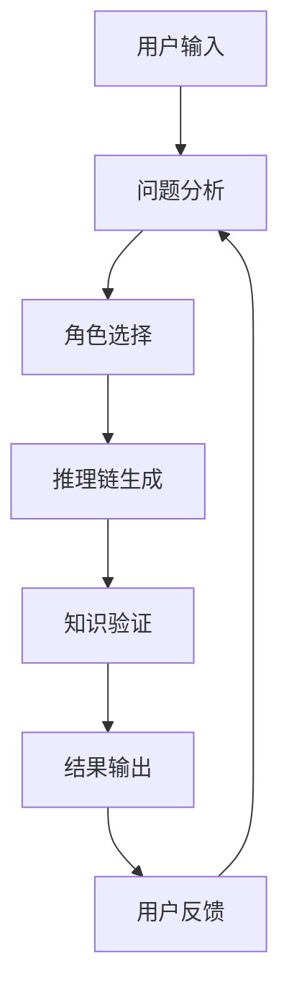

# LLM Chain of Thought (CoT) 设计文档

## 1. 概述

### 1.1 设计目标
- 实现 LLM 的链式思考能力
- 提高复杂问题解决能力
- 增强推理过程的透明度和可解释性
- 支持多步骤、多角度的思考过程

### 1.2 核心特性
- 结构化思考流程
- 动态推理链生成
- 多角色协作思考
- 知识验证与反馈
- 可追溯的推理过程

## 2. 架构设计

### 2.1 系统组件
1. **思考引擎 (Thinking Engine)**
   - 问题分析器
   - 推理链生成器
   - 知识检索器
   - 验证器

2. **角色系统 (Role System)**
   - 角色定义
   - 角色切换
   - 角色协作
   - 角色评估

3. **知识库 (Knowledge Base)**
   - 领域知识
   - 推理规则
   - 经验案例
   - 验证标准

4. **交互系统 (Interaction System)**
   - 用户输入处理
   - 中间结果展示
   - 反馈收集
   - 结果输出

### 2.2 工作流程


## 3. 提示词设计

### 3.1 基础模板
```markdown
# 角色: [角色名称]
## 思考过程
1. 问题分析
   - 理解问题背景
   - 识别关键信息
   - 确定解决方向

2. 推理步骤
   - 步骤1: [具体推理]
   - 步骤2: [具体推理]
   - 步骤3: [具体推理]

3. 知识应用
   - 相关知识点1
   - 相关知识点2
   - 验证方法

4. 结论生成
   - 主要结论
   - 支持证据
   - 潜在问题
```

### 3.2 专业领域模板
```markdown
# 领域: [领域名称]
## 专业思考框架
1. 领域知识应用
   - 核心概念
   - 专业方法
   - 最佳实践

2. 问题分解
   - 子问题1
   - 子问题2
   - 子问题3

3. 解决方案
   - 方案设计
   - 实施步骤
   - 效果评估
```

## 4. 实现细节

### 4.1 思考链生成
1. **问题分析阶段**
   ```python
   def analyze_problem(input_text):
       # 1. 提取关键信息
       key_info = extract_key_info(input_text)
       
       # 2. 确定问题类型
       problem_type = classify_problem(key_info)
       
       # 3. 生成分析报告
       analysis = generate_analysis(key_info, problem_type)
       
       return analysis
   ```

2. **推理链生成**
   ```python
   def generate_reasoning_chain(analysis):
       # 1. 选择推理策略
       strategy = select_strategy(analysis)
       
       # 2. 生成推理步骤
       steps = generate_steps(strategy)
       
       # 3. 验证推理过程
       validated_steps = validate_steps(steps)
       
       return validated_steps
   ```

### 4.2 知识验证
1. **知识检索**
   ```python
   def retrieve_knowledge(step):
       # 1. 确定知识范围
       scope = determine_scope(step)
       
       # 2. 检索相关知识
       knowledge = search_knowledge_base(scope)
       
       # 3. 相关性评估
       relevance = evaluate_relevance(knowledge, step)
       
       return knowledge, relevance
   ```

2. **验证过程**
   ```python
   def validate_step(step, knowledge):
       # 1. 检查逻辑一致性
       logic_check = check_logic(step)
       
       # 2. 验证知识支持
       knowledge_check = verify_knowledge(step, knowledge)
       
       # 3. 生成验证报告
       validation_report = generate_report(logic_check, knowledge_check)
       
       return validation_report
   ```

## 5. 优化策略

### 5.1 性能优化
1. **缓存机制**
   - 思考链缓存
   - 知识检索缓存
   - 验证结果缓存

2. **并行处理**
   - 多步骤并行推理
   - 并发知识检索
   - 并行验证

### 5.2 质量优化
1. **推理质量**
   - 增加验证步骤
   - 引入专家知识
   - 添加反馈机制

2. **知识质量**
   - 知识库更新
   - 知识验证
   - 知识关联

## 6. 使用示例

### 6.1 基础使用
```python
# 初始化 CoT 系统
cot_system = CoTSystem(
    thinking_engine=ThinkingEngine(),
    role_system=RoleSystem(),
    knowledge_base=KnowledgeBase()
)

# 处理用户输入
result = cot_system.process(
    input_text="分析这个代码的性能问题",
    role="性能分析专家"
)

# 输出结果
print(result.analysis)
print(result.reasoning_chain)
print(result.conclusion)
```

### 6.2 高级使用
```python
# 自定义思考策略
custom_strategy = {
    "analysis_depth": "deep",
    "validation_level": "strict",
    "knowledge_scope": "comprehensive"
}

# 使用自定义策略
result = cot_system.process(
    input_text="分析这个代码的性能问题",
    role="性能分析专家",
    strategy=custom_strategy
)
```

## 7. 最佳实践

### 7.1 提示词设计
1. **清晰的结构**
   - 明确的角色定义
   - 详细的思考步骤
   - 完整的验证过程

2. **灵活的自适应**
   - 根据问题调整深度
   - 动态选择推理策略
   - 自适应知识范围

### 7.2 系统配置
1. **性能配置**
   - 缓存大小设置
   - 并行度控制
   - 超时处理

2. **质量配置**
   - 验证级别
   - 知识范围
   - 反馈机制

## 8. 未来展望

### 8.1 功能扩展
1. **多模态支持**
   - 图像理解
   - 音频处理
   - 视频分析

2. **高级推理**
   - 因果推理
   - 类比推理
   - 创造性思维

### 8.2 系统优化
1. **智能调度**
   - 动态资源分配
   - 负载均衡
   - 故障恢复

2. **知识增强**
   - 自动知识更新
   - 知识图谱集成
   - 跨领域知识迁移 