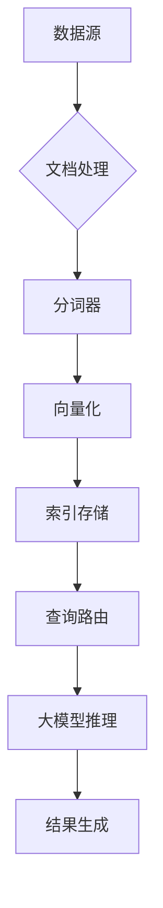

# BugAgaric项目学习指南

## 一、项目概述
BugAgaric是一个智能检索增强系统，集成多种自然语言处理技术，提供高效准确的文档检索和问答解决方案。核心功能包括多模态检索、模型微调优化、工作流系统、评估优化和模块化架构设计。

### 主要应用场景
- 企业智能客服与知识库管理
- 开发者快速构建RAG应用
- 研究人员进行检索算法与模型优化研究

## 二、环境准备
### 2.1 基础环境配置
```bash
# 克隆仓库
git clone https://github.com/your-org/bugagaric.git

# 安装依赖
pip install -r requirements.txt

# 配置环境变量
cp .env.example .env
```

### 2.2 必要服务启动
需按顺序启动以下服务：
```bash
# 清理环境（可选）
docker-compose down --remove-orphans

docker-compose -f docker-compose.db.yml down --remove-orphans
# 启动基础服务
docker-compose up -d
# 启动数据库服务
docker-compose -f docker-compose.db.yml up -d
# 启动搜索引擎服务
docker-compose -f docker-compose.es.yml up -d
# 启动向量数据库服务
docker-compose -f docker-compose.milvus.yml up -d
# 启动对象存储服务
docker-compose -f docker-compose.minio.yml up -d
```

### 2.3 本地调试启动
```bash
# 初始化本地环境
python config/local_debug/init_local_env.py

# 启动本地调试
python config/local_debug/start_local_debug.py
```

## 三、核心模块概览

### 3.1 架构设计


### 3.2 核心功能模块
### 3.1 智能检索增强
- **多模态检索**：支持文本、图像等多种模态
- **混合检索策略**：结合稠密检索、稀疏检索和ColBERT
- **知识对齐**：提升检索准确性的关键技术

### 3.2 模型微调与优化
- **嵌入模型微调**：支持LoRA高效微调、自蒸馏优化
- **模型合并**：基础模型与LoRA参数合并，支持多种精度

### 3.3 工作流系统
- **智能代理工作流**：自动化任务处理
- **知识对齐工作流**：优化知识库结构
- **可视化RAG工作流**：直观展示检索过程

## 四、开发指南

### 4.1 环境搭建
```bash
# 推荐使用虚拟环境
python -m venv .venv && .\.venv\Scripts\activate
pip install -r requirements.txt
```

### 4.2 运行指令
```bash
# 开发模式
uvicorn src.main:app --reload
# 生产部署
docker-compose up
```

### 4.3 常用调试命令
```bash
# 向量索引重建（开发环境）
python -m scripts.build_index --data-dir ./data/raw
# 性能监控
nvidia-smi dmon -s udgcm -o T
```

## 五、WebUI使用指南
### 4.1 基本操作流程
1. 在**模型管理**页面选择并加载模型
2. 切换至**知识管理**页面上传文档并构建知识库
3. 进入**Chat/Inference**页面选择工作流进行对话

### 4.2 模型管理
支持LLM、Embedding和Reranker三类模型，提供本地加载与API加载两种方式。

### 4.3 知识库管理
1. 上传文件（支持PDF和TXT）
2. 选择文件并配置参数
3. 构建知识库（包含Index、Org_Files和Chunk_Files）

## 六、典型工作流程

### 6.1 快速入门示例
```python
from client import RAGClient
client = RAGClient()
response = client.query(
    question="What is the RAG architecture?",
    params={
        "top_k": 5,          # 最大检索文档数
        "chunk_size": 1024   # 文本分块大小
    }
)
print(response.text)         # 输出生成结果
```
### 5.1 Vanilla RAG
包含意图识别功能，无需检索的问题直接生成回复，需要检索的问题执行单次检索与重排序。

### 5.2 模型微调流程
#### SFT训练
```JSON
{"messages": [{"role": "system", "content": "You are helpful"}, {"role": "user", "content": "What's the capital of France?"}, {"role": "assistant", "content": "..."}]}
```

#### DPO训练
```JSON
{"query": "xxx", "retrieval_result": ["xxx", "xxx"], "chosen": {"text": "xxx"}, "rejected": {"text": "xxx"}}
```

### 5.3 评估流程
支持检索指标（MRR、NDCG、Recall）和生成指标（Rouge、EM、Accuracy等）评估。

## 七、常见问题解决

## 八、核心功能开发规范

| 模块名        | 开发规范要点                  |
|---------------|-------------------------------|
| 向量索引      | 必须支持FAISS/Milvus双后端切换|
| 文本处理      | 分词需适配多语言场景          |
| API层         | 全部接口添加OpenAPI规范文档   |

## 九、版本迭代与升级注意事项

```text
v1.3.0 (2023-10-15)
> [必选] MongoDB升级到5.x版本
> [新增] 启用multi-language模块需安装langdetect组件
```

## 十、团队协作规范

### 10.1 分支命名规则
- `feature/<功能名称>` # 新功能开发分支
- `hotfix/<问题编号>-<描述>` # 紧急修复分支
- `release/v1.x` # 版本发布分支

### 10.2 PR审查要点
1. 测试覆盖率≥90%
2. 需提供性能对比报告（如响应时间/资源消耗）
3. 文档更新需包含版本变更说明

## 六、常见问题解决
### 6.1 服务连接超时
- 检查相关服务是否已启动
- 确认服务端口是否正确
- 检查防火墙设置

### 6.2 依赖安装问题
```bash
# 使用devpi本地镜像源
pip install -r requirements.txt -i http://localhost:3141/root/pypi/+simple/

# 使用清华镜像源
pip install -r requirements.txt -i https://pypi.tuna.tsinghua.edu.cn/simple
```

### 6.3 孤儿容器问题
```bash
docker-compose up -d --remove-orphans
```

## 七、高级功能
### 7.1 VisRAG部署
```bash
# 下载模型
modelscope download --model tcy006/VisRAG-Ret --local_dir ./resource/models/VisRAG-Ret
modelscope download --model OpenBMB/MiniCPM-V-2_6 --local_dir ./resource/models/MiniCPM-V-2_6
```

### 7.2 性能优化建议
- 根据硬件配置调整batch size
- 使用BF16精度加速训练
- 合理设置检索top_k值平衡效果与效率

## 八、学习资源
- **API文档**：详细接口定义请参考<mcfile name="api_docs.md" path="d:\BugAgaric-BUG\docs\api\魔苟\api_docs.md"></mcfile>
- **评估报告**：系统性能指标请参考<mcfile name="evaluation_report.md" path="d:\BugAgaric-BUG\docs\evaluation_report\evaluation_report.md"></mcfile>
- **典型实现**：详细技术实现请参考<mcfile name="typical_implementation.md" path="d:\BugAgaric-BUG\docs\typical_implementation\typical_implementation.md"></mcfile>