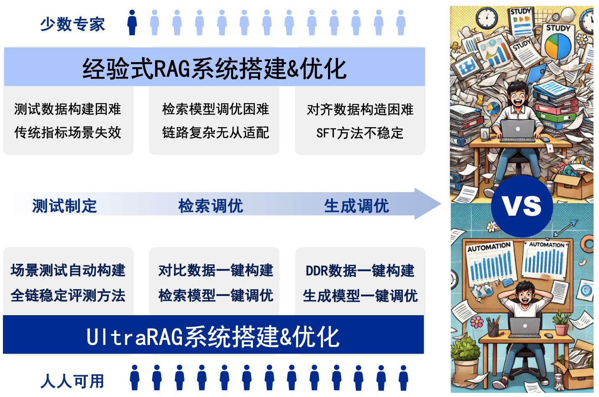
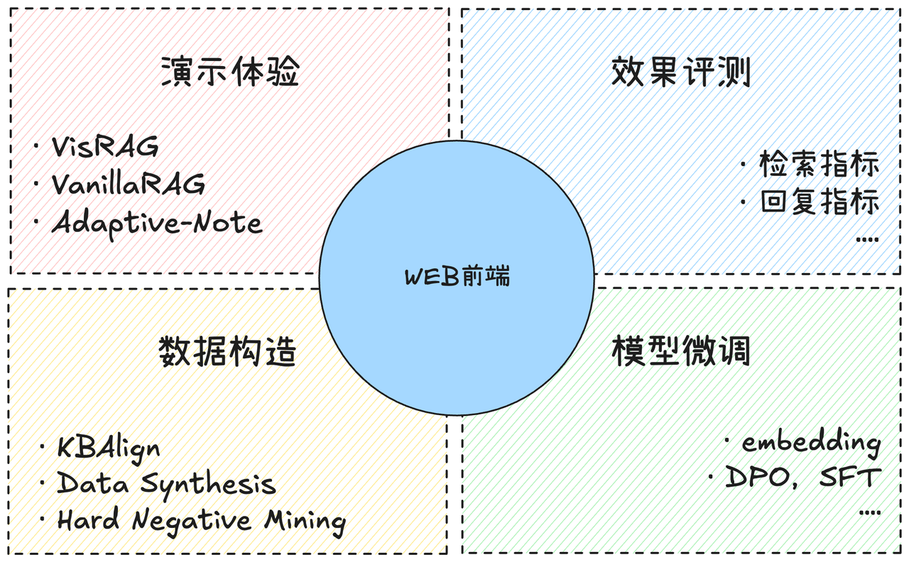
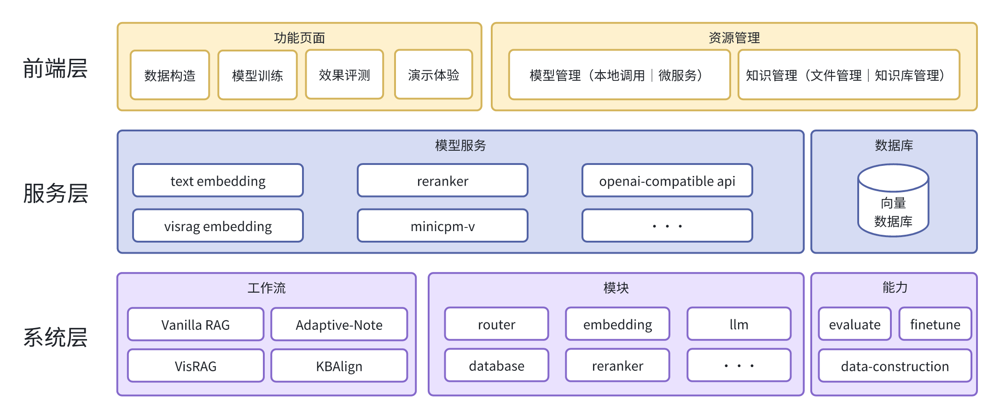

<div align="center">
    
</div>
<p align="center">
    【<a href="../README.md">English</a>   | Chinese】
</p>


## 📖 概述

**BugAgaric 框架**由清华大学THUNLP联合东北大学NEUIR、面壁智能团队及9#AISoft团队共同提出，基于敏捷化部署与模块化构造，引入了自动化的“数据构建-模型微调-推理评测”知识适配技术体系，提供了一站式、科研与开发双重友好的 RAG 系统解决方案。BugAgaric 显著简化了 RAG 系统在领域适配过程中，从数据构建到模型微调的全流程，助力科研人员与开发者高效应对复杂任务：

<div align="center">
    
</div>

- **零代码编程WebUI支持：** 零编程经验用户亦可上手操作全链路搭建和优化过程，包括 **多模态RAG方案VisRAG** ；
- **合成与微调一键式解决：** 以自研**KBAlign、RAG-DDR**等方法为核心，一键式系统化数据构建 + 检索、生成模型多样微调策略支持下的性能优化；
- **多维多阶段稳健式评估：** 以自研**RAGEval**方法为核心，融入面向有效/关键信息的多阶段评估方法，显著提升“模型评估”的稳健性；
- **科研友好探索工作集成：** 内置**THUNLP-RAG组自研方法**及其他前沿RAG方法，支持模块级持续探索与研发。

**以上全部功能，都可以直接通过 web ****前端****快速实现。**

<div align="center">
    
</div>

## ⚡️快速开始

### 环境依赖

**CUDA** 版本在**12.2**及以上

**Python** 版本在**3.10**及以上

### 快速部署

你可以通过以下几种方式部署 BugAgaric，运行前端页面：

1. **通过docker部署**

运行以下命令，然后在浏览器访问“[http://localhost:8843](http://localhost:8843/)"。

```Bash
docker-compose up --build -d
```

2. **通过****conda****部署**

运行以下命令，然后在浏览器访问“[http://localhost:8843](http://localhost:8843/)"。

```Bash
# 创建conda环境
conda create -n bugagaric python=3.10

#激活conda环境
conda activate bugagaric

# 安装相关依赖
pip install -r requirements.txt

# 运行以下脚本下载模型，默认下载到resources/models目录下
# 下载的模型列表在config/models_download_list.yaml中
python scripts/download_model.py

# 运行demo页面
streamlit run bugagaric/webui/webui.py --server.fileWatcherType none
```

### 简单上手

https://github.com/user-attachments/assets/b04d5317-3378-4d4f-80e4-0e84dea54778


以上视频简单演示了上手体验过程，为了方便您使用 BugAgaric，我们提供了一份详细的说明文档，方便您上手 BugAgaric 完成体验和调优模型[使用说明](../user_guide/user_guide.md)。

如果您对其中涉及到的技术方案更感兴趣，您可以通过[UltraRAG系列](../typical_implementation/typical_implementation.md)获取更全面的了解。

## 🔧整体架构

BugAgaric 的架构由  **前端** **、服务和后端** 三个部分组成，具体介绍如下：

* **后端**
  * **Modules （模块层）：**  定义 RAG 系统中的关键组成部分，例如知识库、检索模型、生成模型等，支持用户基于标准类进行灵活定制。
  * **Workflow（流程层）：** 规范 RAG 系统的组成模式，提供标准化的基础 RAG 实现，并集成团队自研的典型方法，如 Adapative-Note、VisRAG 等，支持用户灵活搭建与调整，且将持续补充与优化。
  * **Function （功能层）：** 负责 RAG 系统优化过程中的关键操作，包括数据合成、系统评估和模型微调等，助力系统性能的全面提升。
* **服务** ：BugAgaric 除了支持基于实例方式搭建 RAG 系统，还提供微服务部署模式，以优化应用过程中的用户体验，支持 Embedding Model、LLM 以及向量数据库等关键服务的灵活部署。
* **前端** ：前端划分为资源管理与功能页面两个部分。其中，资源管理包括 **模型管理** 和  **知识库管理** ，而功能页面涵盖 **数据构造、模型训练、效果评测** 及  **推理体验** ，为用户提供便捷的交互支持。

<div align="center">
    
</div>

## 💫效果评估

为了验证 BugAgaric 在垂直领域的应用效果，我们以法律领域为例，收集了各类专业书籍，构建了包含 **88 万个切片** 的知识库，并基于相对完备的评测数据集，在 BugAgaric 上进行了系统性评估。以下为我们的评测结果。如需了解评测的详细内容，请参阅相关文档：[评测报告](../evaluation_report/evaluation_report.md)。

| **端到端效果**       | **法条预测（3-2）****ROUGE-L** |
| -------------------------- | ------------------------------------ |
| **VanillaRAG**       | 40.75                                |
| **BugAgaric-DDR**     | 53.14                                |
| **BugAgaric-KBAlign** | 48.72                                |

| **端到端效果**             | **咨询（3-8）****ROUGE-L** |
| -------------------------------- | -------------------------------- |
| **VanillaRAG**             | 23.65                            |
| **BugAgaric-Adaptive-Note** | 24.62                            |
| **VanillaRAG-finetune**    | 25.85                            |

## ‍🤝致谢

感谢以下贡献者的代码提交和测试，欢迎新成员加入我们，致力于构建完整生态！

<a href="https://github.com/OpenBMB/BugAgaric/contributors">
  
</a>

## 🌟趋势

<a href="https://star-history.com/#OpenBMB/BugAgaric&Date">
 <picture>
   <source media="(prefers-color-scheme: dark)" srcset="https://api.star-history.com/svg?repos=OpenBMB/BugAgaric&type=Date&theme=dark" />
   <source media="(prefers-color-scheme: light)" srcset="https://api.star-history.com/svg?repos=OpenBMB/BugAgaric&type=Date" />
   
 </picture>
</a>

## ⚖️许可

- 源代码采用[Apache-2.0](https://github.com/OpenBMB/MiniCPM/blob/main/LICENSE)许可证授权。

## 📑引用

如果您觉得这个仓库有用，请考虑给一个星标 ⭐ 并引用支持。

```bib
@article{li2024rag,
  title={RAG-DDR: Optimizing Retrieval-Augmented Generation Using Differentiable Data Rewards},
  author={Li, Xinze and Mei, Sen and Liu, Zhenghao and Yan, Yukun and Wang, Shuo and Yu, Shi and Zeng, Zheni and Chen, Hao and Yu, Ge and Liu, Zhiyuan and others},
  journal={arXiv preprint arXiv:2410.13509},
  year={2024}
}

@article{yu2024visrag,
  title={Visrag: Vision-based retrieval-augmented generation on multi-modality documents},
  author={Yu, Shi and Tang, Chaoyue and Xu, Bokai and Cui, Junbo and Ran, Junhao and Yan, Yukun and Liu, Zhenghao and Wang, Shuo and Han, Xu and Liu, Zhiyuan and others},
  journal={arXiv preprint arXiv:2410.10594},
  year={2024}
}

@article{wang2024retriever,
  title={Retriever-and-Memory: Towards Adaptive Note-Enhanced Retrieval-Augmented Generation},
  author={Wang, Ruobing and Zha, Daren and Yu, Shi and Zhao, Qingfei and Chen, Yuxuan and Wang, Yixuan and Wang, Shuo and Yan, Yukun and Liu, Zhenghao and Han, Xu and others},
  journal={arXiv preprint arXiv:2410.08821},
  year={2024}
}

@article{zeng2024kbalign,
  title={KBAlign: KBAlign: Efficient Self Adaptation on Specific Knowledge Bases},
  author={Zeng, Zheni and Chen, Yuxuan and Yu, Shi and Yan, Yukun and Liu, Zhenghao and Wang, Shuo and Han, Xu and Liu, Zhiyuan and Sun, Maosong},
  journal={arXiv preprint arXiv:2411.14790},
  year={2024}
}

@article{zhu2024rageval,
  title={Rageval: Scenario specific rag evaluation dataset generation framework},
  author={Zhu, Kunlun and Luo, Yifan and Xu, Dingling and Wang, Ruobing and Yu, Shi and Wang, Shuo and Yan, Yukun and Liu, Zhenghao and Han, Xu and Liu, Zhiyuan and others},
  journal={arXiv preprint arXiv:2408.01262},
  year={2024}
}
```
