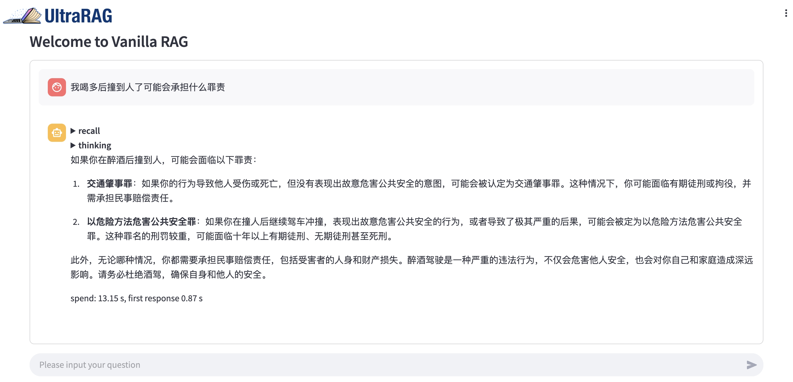
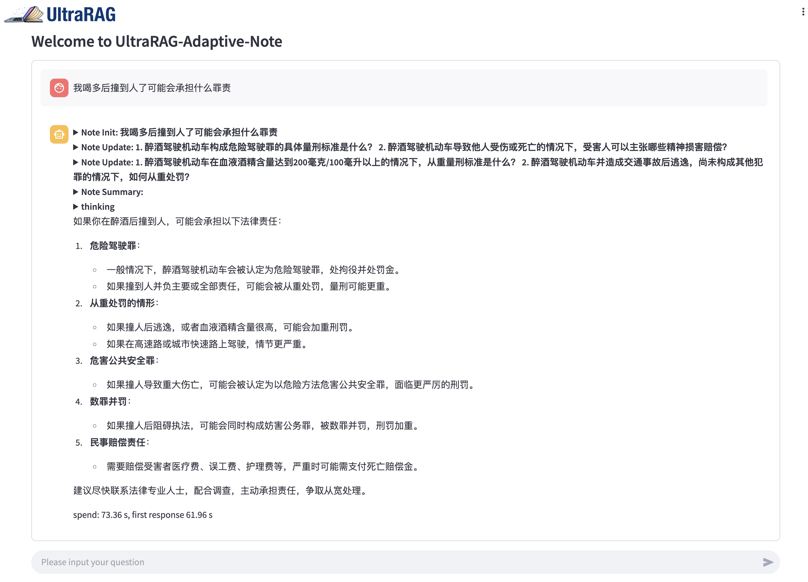
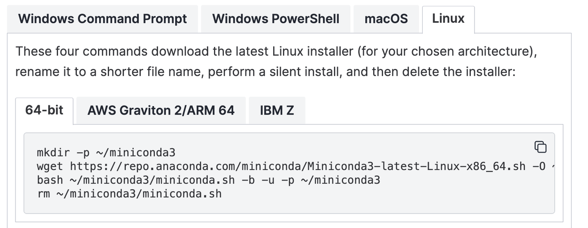

# Integrating R1 into Multi-round RAG --- BugAgaric+R1 Local Deployment Tutorial

Recently, DeepSeek's open-source DeepSeek R1 series models have become popular worldwide, but the "server busy" issue has discouraged many users. In this tutorial, I will use the BugAgaric framework as an example to introduce the local deployment process of DeepSeek R1 and guide you through setting it up while familiarizing you with the details and features of BugAgaric. After successfully running VanillaRAG, I also briefly experimented with Adaptive-Note enhanced by DeepSeek R1, asking a few questions in a legal context. The results were surprisingly good. No exaggeration, no bias—here's a screenshot as proof.





Taking the screenshot as an example, I asked both [VanillaRAG]() and [Adaptive-Note]() on BugAgaric the question, “What legal responsibilities might I face if I hit someone after drinking too much?” VanillaRAG provided a simple and direct answer, listing the possible charges and suggestions. It seemed fine at first but lacked detail. On the other hand, Adaptive-Note not only summarized the possible charges but also analyzed the impact of alcohol content and the attitude toward post-incident handling on sentencing and compensation. It cited references and was well-supported by reasoning. Overall, Adaptive-Note seems to provide a better response.

> VanillaRAG: The most basic RAG (Retrieval-Augmented Generation) architecture, usually referring to  **the standard RAG method that has not been optimized or improved** . Its basic process is as follows:  **Query Formation** ,  **Retrieval** , and  **Generation** .
>
> Adaptive-Note: A **adaptive note-enhanced RAG method** for complex Q&A tasks, adopting a **retriever-and-memory** mechanism, which iteratively collects and optimizes knowledge structures. It improves the quality of knowledge interaction through **adaptive memory review** and  **task-oriented generation** , and ensures sufficient information retrieval with a  **note-based exploration termination strategy** , ultimately enhancing the answer quality. Paper: [https://arxiv.org/abs/2410.08821](https://arxiv.org/abs/2410.08821).

At this point, I believe many of you may be eager to experience BugAgaric. Let's now take a closer look at the deployment process of BugAgaric.

## Hardware Environment Preparation

The DeepSeek R1 model has several distilled versions: 7B, 14B, 70B, and the full 671B version. Considering the balance between conditions and performance, we have chosen the 14B version of the model for deployment. Below are the basic hardware requirements for running BugAgaric:

| **Parameter** | **Value**                |
| ------------------- | ------------------------------ |
| GPU                 | A100-80GB (or other 80GB GPUs) |
| CUDA                | ≥ 12.4                        |
| System              | Ubuntu 22.04 (optional)        |
| Disk Space          | ≥ 50GB                        |

It is important to note that the NVIDIA GPU driver must be compatible with the CUDA version. Otherwise, vllm may encounter errors when running the model. If your GPU is incompatible, you can try reinstalling the driver and CUDA. A simple and effective installation method is recommended to avoid compatibility issues between CUDA and the driver. You just need to log in to the [NVIDIA official website](https://developer.nvidia.com/cuda-toolkit-archive) and select the appropriate CUDA toolkit version for installation. Make sure to choose the installation parameters that suit your system (it is recommended to use the runfile installation method, as it is simple and convenient).


## BugAgaric Configuration

Now that you have a stable running environment, it's time to configure BugAgaric. You need to download it from the repository and place it in the appropriate location: [https://github.com/OpenBMB/BugAgaric](https://github.com/OpenBMB/BugAgaric) (don't forget to give it a star~). Next, let's configure the Python library dependencies required by BugAgaric.

There are two ways to run BugAgaric. One is to run it via Docker, which is the easiest way, provided that you have nvidia-docker installed and configured on your machine, and have the necessary permissions to run it (usually requires root privileges). In this case, you just need to run this command:

```Bash
docker-compose up --build -d
```

However, if your machine doesn't have nvidia-docker, don't worry. We can also configure a conda environment to run it.

First, make sure that conda is installed on your local machine. If not, don't worry. You can find installation instructions at this [link](https://docs.anaconda.com/miniconda/install/). Just install it with a regular user account—it's easy to execute with just a few commands!



Next, install the dependencies for BugAgaric in the conda environment. Just execute the following commands in order:

```Bash
# Create conda environment
conda create -n bugagaric python=3.10
# Activate the conda environment
conda activate bugagaric
# Install required dependencies
pip install -r requirements.txt -i https://pypi.tuna.tsinghua.edu.cn/simple
```

Once the above steps are completed, the environment dependencies are ready. However, we’re not done yet, as the next step is to download the models.

For downloading the models, we need to download the following 3 models. Just execute the commands below:

| **Model**              | **Function** | **Download Command**                                                                                                     |
| ---------------------------- | ------------------ | ------------------------------------------------------------------------------------------------------------------------------ |
| DeepSeek-R1-Distill-Qwen-14B | LLM                | modelscope download --model deepseek-ai/DeepSeek-R1-Distill-Qwen-14B --local_dir ./resource/model/DeepSeek-R1-Distill-Qwen-14B |
| MiniCPM-Embedding-Light      | Embedding          | modelscope download --model OpenBMB/MiniCPM-Embedding-Light --local_dir ./resource/model/MiniCPM-Embedding-Light               |
| MiniCPM-Reranker-Light       | Reranker           | modelscope download --model OpenBMB/MiniCPM-Reranker-Light --local_dir ./resource/model/MiniCPM-Reranker-Light                 |

After the models are downloaded, let’s run the llm service. Specifically, execute the following command:

```Bash
vllm serve DeepSeek-R1-Distill-Qwen-14B --gpu-memory-utilization 0.8 --dtype auto --api-key token-abc123
```

Here’s a brief explanation of the parameters:

* --gpu-memory-utilization 0.8: This represents the GPU memory utilization. For a GPU with 80GB of memory, 0.8 means a maximum usage of 64GB.
* --dtype auto: This allows vllm to automatically select the model's parameter type.
* --api-key token-abc123: This is the custom API key for the model, set to token-abc123.

Once the vllm service is deployed, it will start the OpenAI-compatible service with the default parameters as shown:

| base_url | [http://localhost:8000/v1](http://localhost:8000/v1) |
| -------- | ------------------------------------------------- |
| model    | DeepSeek-R1-Distill-Qwen-14B                      |
| api-key  | token-abc123                                      |

To keep the service running in the background, you can use the following command:

```Bash
nohup vllm serve DeepSeek-R1-Distill-Qwen-14B --gpu-memory-utilization 0.8 --dtype auto --api-key token-abc123 &
```

Now, the environment is set up, the models are downloaded, and we can run BugAgaric:

```Bash
streamlit run bugagaric/webui/webui.py --server.fileWatcherType none
```

If everything goes smoothly, we should see the following result, which indicates that the WebUI is up and running. We can copy the URL into the browser, and the page should be accessible. It provides three URLs, and you can use any one of them to access the page.


## Conversation with DeepSeek R1

See the video in the link for more details: 


[](https://youtu.be/zPiYfHpqskM?si=z_6RdTWlIcddCoqi)
