## 典型实现

### General methods

#### Vanilla RAG

##### 方法概述

BugAgaric 在该模块中新增了 **意图识别功能** ，针对无需检索的问题，可直接生成回复，从而提升响应效率。对于需要检索的问题，系统将执行单次检索与重排序，并根据检索内容生成精准回答。

##### 图示：

recall包含检索内容，如果意图识别无需检索则直接生成回复。

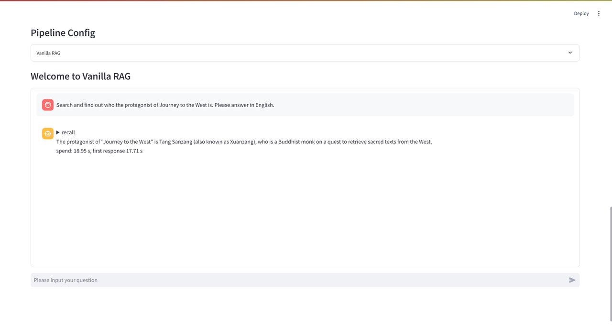

#### DPO & SFT

##### 训练：

###### **方法概述：**

Direct Preference Optimization（DPO）和 Supervised Fine-Tuning（SFT）是提升大语言模型（LLM）性能及对齐能力的两种核心技术手段。两者分别从**偏好优化**和**监督学习**的角度，为复杂任务提供不同的解决方案，并在构建高质量生成模型的过程中发挥互补作用。

**DPO** 的核心思想是直接利用偏好数据优化模型，使其生成的输出更符合用户的实际需求。该方法通过用户反馈构造偏好对，将生成任务形式化为优化偏好分布的过程。与基于强化学习的奖励建模（如 RLHF）不同，DPO 直接优化偏好函数以调整模型行为，无需额外设计奖励函数，从而避免复杂的策略优化，并显著提升生成结果的对齐性与用户满意度。

**SFT** 采用经典的监督学习范式，通过高质量的输入-输出对（如任务标签数据）对模型进行微调，旨在精准学习特定任务的映射关系，以提供强大的初始性能。SFT 的训练过程通常依赖大规模标注数据，并通过最小化训练误差来提升生成质量。然而，由于对标签数据的依赖，其在应对多样化场景时的泛化能力相对有限。

我们基于 trl 库提供 DPO 与 SFT 两种微调训练方案，用户可根据需求将数据转换为相应格式，进而开展相应的训练过程。

###### **参数：**

| 参数名                | 是否必须 | 参数类型   | 参数说明                                                                                                     | 参数示例/默认值                                   |
| --------------------- | -------- | ---------- | ------------------------------------------------------------------------------------------------------------ | ------------------------------------------------- |
| pipeline_type         | 是       | str        | 指定方法                                                                                                     | DPO（可选择DPO、SFT）                             |
| task_type             | 是       | str        | 指定任务类型                                                                                                 | DPO（可选择DPO、SFT）                             |
| use_lora              | 否       | bool(flag) | 指定训练过程是否采用lora微调训练                                                                             | -                                                 |
| model_name_or_path    | 是       | str        | 拟进行训练的模型路径                                                                                         | your_training_model_path                          |
| train_data_path       | 是       | str        | 训练集路径**(注意：如提供外部训练集，请将数据放置于~/resource/dataset/train_dataset/路径下才可以进行选择）** | ~/resource/dataset/train_dataset/dpos_train.jsonl |
| eval_data_path        | 是       | str        | 验证集路径**(注意：如提供外部验证集，请将数据放置于~/resource/dataset/train_dataset/路径下才可以进行选择）** | ~/resource/dataset/train_dataset/dpos_dev.jsonl   |
| output_dir            | 是       | str        | 训练模型保存路径                                                                                             | ~/output/ddr                                      |
| logging_dir           | 是       | str        | 训练log保存路径                                                                                              | ~/output/logs/ddr                                 |
| deepspeed_config_file | 是       | str        | deepspeed设置文件路径                                                                                        | ~/config/ds_config_zero2.json                     |
| config_file           | 是       | str        | yaml配置文件路径                                                                                             | ~/config/pipeline/finetune.yaml                   |
| log_file              | 是       | str        | 训练日志保存路径                                                                                             | ~/output/logs/ddr/finetune_run.log                |

为简化用户的操作体验，系统仅提供必要参数，部分参数已在 **YAML** 配置文件中预设，用户可直接使用默认值，或根据特定需求进行个性化调整。训练参数基于 transformers.TrainingArguments 类实现，具备高度灵活性，允许用户根据实际需求自定义扩展，以适应多样化的训练场景。

| 参数名                      | 是否必须 | 参数类型 | 参数说明                                                             | 参数示例/默认值                                   |
| --------------------------- | -------- | -------- | -------------------------------------------------------------------- | ------------------------------------------------- |
| Augment_template            | 是       | str      | 数据增强模板                                                         | Background{}Question:{}Answer:                    |
| QA_template                 | 是       | str      | 问答模板                                                             | Question:{}Answer:                                |
| passage_separator           | 是       | str      | 不同文档之间间隔符                                                   | \n                                                |
| model_type                  | 是       | str      | 指定模型的类型                                                       | minicpm3（可选择minicpm3、minicpm2、llama_style） |
| use_template                | 是       | bool     | 指定是否在模型输入阶段使用模板                                       | True                                              |
| max_length                  | 是       | int      | **仅DPO训练包含** ，输入序列（包括prompt和completion）最大长度 | 2200                                              |
| max_prompt_length           | 是       | int      | **仅DPO训练包含** ，prompt最大长度（应小于max_length）         | 2100                                              |
| max_seq_length              | 是       | int``    | **仅SFT训练包含** ，输入序列（包括prompt和completion）最大长度 | 2200                                              |
| max_passage_length          | 是       | int      | 检索文档的最大长度（应小于max_prompt_length或max_seq_length）        | 2000                                              |
| top_n                       | 是       | int      | 检索时返回的文档数量                                                 | 5                                                 |
| optim                       | 是       | str      | 优化器类型                                                           | adamw_torch                                       |
| save_steps                  | 是       | int      | 模型保存的间隔步数                                                   | 100                                               |
| eval_steps                  | 是       | int      | 评估的间隔步数                                                       | 100                                               |
| per_device_train_batch_size | 是       | int      | 每个设备上的训练批次大小                                             | 1                                                 |
| per_device_eval_batch_size  | 是       | int      | 每个设备上的评估批次大小                                             | 2                                                 |
| learning_rate               | 是       | float    | 学习率                                                               | 5e-5                                              |
| eval_strategy               | 是       | str      | 评估策略                                                             | steps                                             |
| logging_steps               | 是       | int      | 日志记录的间隔步数                                                   | 10                                                |
| bf16                        | 是       | bool     | 是否启用 BF16（半精度浮点数）                                        | True                                              |
| num_train_epochs            | 是       | int      | 模型训练的总轮数                                                     | 1                                                 |

###### **图示：**

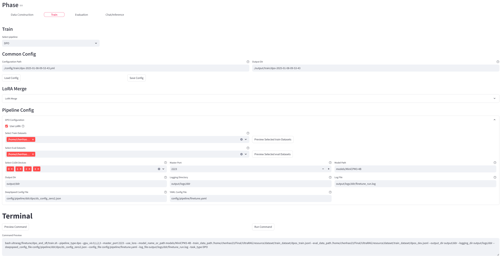

###### **DPO训练输入数据格式：（仅列出训练数据必要字段）**

```JSON
{"query": "xxx", "retrieval_result": ["xxx", "xxx", "xxx", "xxx", "xxx"], 
"chosen": {"text": "xxx"}, 
"rejected": {"text": "xxx"}}
```

###### **SFT训练输入数据格式：（仅列出训练数据必要字段）**

```JSON
{"messages": [{"role": "system", "content": "You are helpful"}, {"role": "user", "content": "What's the capital of France?"}, {"role": "assistant", "content": "..."}]}
{"messages": [{"role": "system", "content": "You are helpful"}, {"role": "user", "content": "Who wrote 'Romeo and Juliet'?"}, {"role": "assistant", "content": "..."}]}
{"messages": [{"role": "system", "content": "You are helpful"}, {"role": "user", "content": "How far is the Moon from Earth?"}, {"role": "assistant", "content": "..."}]}
```

##### **LoRA合并：**

如果训练过程中采用 LoRA 微调，则在训练完成后需要将 LoRA 微调参数与原始模型参数进行合并，以生成完整的模型权重。

###### **参数：**

| 参数名             | 是否必须 | 参数类型 | 参数说明                         | 参数示例/默认值          |
| ------------------ | -------- | -------- | -------------------------------- | ------------------------ |
| model_name_or_path | 是       | str      | 训练模型路径                     | your_training_model_path |
| lora_name_or_path  | 是       | str      | 选择进行合并的 LoRA 微调参数路径 | your_lora_model_path     |
| save_path          | 是       | str      | 保存合并后模型的路径             | your_save_model_path     |

###### **图示：**

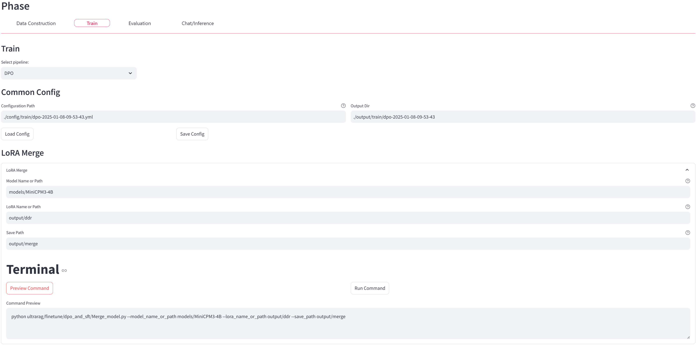

#### Eval

| 参数名               | 是否必须 | 参数类型 | 参数说明            | 参数示例/默认值           |
| -------------------- | -------- | -------- | ------------------- | ------------------------- |
| pipeline_type        | 是       | str      | 指定方法            | vanilla                   |
| embedding_model_path | 否       | str      | Embedding模型的路径 | your_embedding_model_path |

##### Retrieval Eval

| 参数名                     | 是否必须 | 参数类型   | 参数说明                           | 参数示例/默认值             |
| -------------------------- | -------- | ---------- | ---------------------------------- | --------------------------- |
| selected_retrieval_metrics | 否       | str (列表) | 要评估的检索指标列表               | []                          |
| pooling                    | 否       | str        | 池化策略，用于文本表示的聚合方法。 | 默认值："mean"              |
| query_instruction          | 否       | str        | 提取查询文本的指令。               | 默认值：None                |
| queries_path               | 是       | str        | 查询文件的路径。                   | 示例："path/to/queries.txt" |
| corpus_path                | 是       | str        | 语料库文件的路径。                 | 示例："path/to/corpus.txt"  |
| qrels_path                 | 是       | str        | qrels（查询-相关性文件）的路径。   | 示例："path/to/qrels.txt"   |
| retrieval_output_path      | 是       | str        | 保存检索输出结果的路径。           | 示例："path/to/output.txt"  |
| log_path                   | 否       | str        | 保存日志文件的路径。               | 默认值：None                |
| topk                       | 否       | int        | 要检索的前 k 个文档数。            | 默认值：10                  |
| cutoffs                    | 否       | str        | 用于评估指标的截断值，以逗号分隔。 | 默认值：None                |

###### 目前支持的指标：

MRR、NDCG、Recall

输出文件最后一行将包含所有指标各自的平均分

###### 数据格式：

输入数据

包括查询数据 `query.jsonl` 文档数据 `corpus.jsonl`三元组文件 `qrels.tsv`共三个文件

查询数据格式 `query.jsonl` 文档数据格式 `corpus.jsonl`：

```JSON
 {"_id": "aaa", "text": "这是文档1"}
 {"_id": "aaa", "text": "这是查询1"}
```

三元组文件格式 `qrels.tsv`（注意分隔符为\t）

```Plain
query-id    corpus-id    score
aaa    bbb    1
```

输出数据 `result.trec`（注意分隔符为\t）

```Plain
 aaa    Q0    bbb    1    0.1    1
 
 各类含义如下
 <query_id> Q0 <doc_id> <rank> <score> <run_id>
```

##### Generated Eval

**LLM模型参数需要在UltraRAG/config/pipeline/eval/eval.yaml配置**

| 参数名                     | 是否必须 | 参数类型    | 参数说明                                                                   | 参数示例/默认值              |
| -------------------------- | -------- | ----------- | -------------------------------------------------------------------------- | ---------------------------- |
| selected_generated_metrics | 否       | str (列表)  | 要评估的生成指标列表                                                       | 默认值：[]                   |
| test_dataset               | 是       | str (列表)  | 数据集文件列表（json 或 jsonl）                                            | dataset1.json dataset2.jsonl |
| output_path                | 是       | str         | 结果保存路径                                                               | results/output.json          |
| knowledge_id               | 否``     | str (列表)  | 知识库列表``                                                               | collection1 collection2      |
| knowledge_stat_tab_path    | 否       | str         | 知识库管理表格路径``                                                       | your_knowledge_stat_tab_path |
| evaluate_only              | 否       | bool (flag) | 若设置，则跳过生成，直接评估数据集**（需要符合检索或生成评测的输入格式）** | False                        |
| metric_api_key             | 否       | str         | 用于评测指标的模型的 API 密钥                                              | your_api_key                 |
| metric_base_url            | 否       | str         | 用于评测指标的模型的 base_url                                              | your_base_url                |
| metric_model_name          | 否       | str         | 用于评测指标的模型的 model_name                                            | your_model_name              |
| api_key                    | 否       | str         | 用于被评测的模型的 API 密钥                                                | your_api_key                 |
| base_url                   | 否       | str         | 用于被评测的模型的 base_url                                                | your_base_url                |
| model_name                 | 否       | str         | 用于被评测的模型的 model_name                                              | your_model_name              |
| reranker_model_path        | 否       | str         | 重排序模型的路径                                                           | your_reranker_model_path     |

###### 目前支持的指标：

Completeness（RAGEval）、Rouge、EM、Accuracy、F1、BLEU、Meteor、Bert

输出文件最后一行将包含所有指标各自的平均分

###### 数据格式：

输入数据

一定要包含query和answer，如果需要不被检索的system_prompt则以instruction传入

```JSON
{"id": 0, "query": "xxx？", "answer": "xxx", "prediction": "xxxyyy", "instruction":"this is optional key"}
{"id": 0, "query": "aaa？", "answer": "bbb", "prediction": "bbb"}
```

输出数据

```JSON
{"id": 0, "query": "xxx？", "answer": "xxx", "prediction": "xxxyyy", "xxx_score": 20.12, "xxx_score": 20.26}
{"id": 0, "query": "aaa？", "answer": "bbb", "prediction": "bbb", "x_score": 100.00, "xx_score": 100.00}
{"average_scores": {"x": 60.06, "xx": 60.13}
```

### BugAgaric-Series

#### BugAgaric-Adaptive-Note

##### 出处、方法图与效果：

 **论文地址：** [Retriever-and-Memory: Towards Adaptive Note-Enhanced Retrieval-Augmented Generation](https://arxiv.org/abs/2410.08821)

 **GitHub地址：** **[BugAgaric-Adaptive-Note](https://github.com/thunlp/Adaptive-Note)**

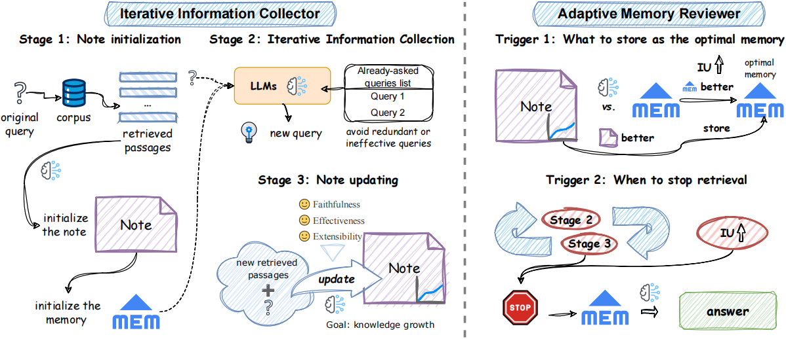

##### 方法概述：

为解决现有 RAG 系统在复杂问答任务中面临的 **信息不足** 与 **交互性差** 等挑战，我们提出了一种全新的端到端方法—— **BugAgaric-Adaptive-Note** 。该方法由以下三个核心模块组成：

1. **迭代信息收集器（Iterative Information Collector, IIC）**

IIC 以笔记作为知识载体，对检索信息进行系统化整合与动态更新。在初始阶段，利用 LLM 从检索到的参考文献中生成初始笔记，并将其作为最佳记忆存储。随后，在迭代过程中，IIC 基于现有最佳记忆预测新的检索查询，持续更新笔记内容，以实现知识的动态扩充。

2. **自适应记忆审阅器（Adaptive Memory Reviewer, AMR）**

AMR 负责动态评估更新笔记与最佳记忆的内容质量，决定是否替换现有笔记。同时，AMR 设计了基于笔记的停止探索策略，以避免过度检索。该策略确保在信息增益不显著时及时终止信息收集，提升系统运行效率。

3. **任务导向生成器（Task-Oriented Generator）**

该模块从最佳记忆中提取关键信息，以生成高质量答案，并支持多种问答任务格式，确保答案的针对性与准确性。

通过上述模块的协同作用，**BugAgaric-Adaptive-Note** 从知识增长的视角实现了复杂问题的高效解答，并在 **多跳问答** 和 **长文生成** 任务中展现出显著的性能优势。

##### 图示：

过程包含每一次检索内容以及当前笔记和最佳笔记，最后显示回复内容与回复时间

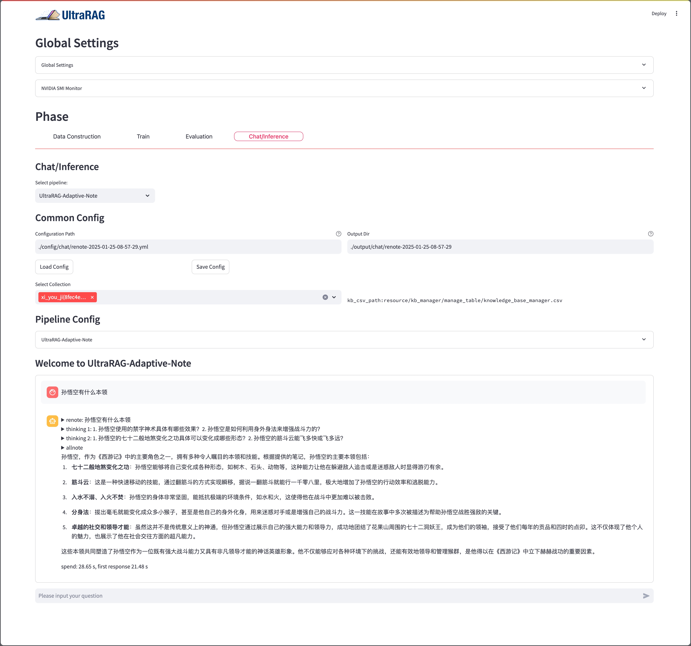

#### BugAgaric-KBAlign

##### 出处、方法图与效果：

 **论文地址：** [KBAlign: Efficient Self Adaptation on Specific Knowledge Bases](https://arxiv.org/abs/2411.14790)

 **GitHub地址：** [KBAlign GitHub](https://github.com/thunlp/KBAlign?tab=readme-ov-file)

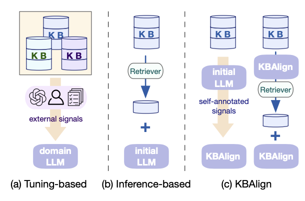

##### 方法概述：

**BugAgaric-KBAlign** 旨在增强大语言模型（LLMs）在处理涉及知识库的下游任务时的知识适应能力。不同于传统依赖外部信号（如人工偏好数据或更强大 LLM 注释）的方法，**KBAlign** 采用  **自监督学习** ，以实现高效、低成本的知识适应。其方法主要包括以下三个关键部分：

* **长短依赖结合的自我标注训练数据**

通过结合长短依赖关系，自动生成高质量的训练数据，提升模型对知识库信息的理解和适应能力。

* **自我校验与迭代训练**

采用自我校验机制，在迭代训练过程中不断优化模型，使其在无监督环境下逐步提高知识对齐效果。

* **推理优化**

在推理阶段，利用对齐后的知识表示优化生成过程，确保答案的准确性和一致性。

##### 数据构造：

**BugAgaric-KBAlign** 采用 **长短依赖结合的自我标注方法** 构造训练数据，以增强模型的知识适应能力。

* **短依赖标注**  仅关注单个 **chunk** 的局部信息，确保模型对细粒度知识的精准理解。
* **长依赖标注**  分为 **同质数据** 和  **异质数据** ，以构建更丰富的问答对：
  * **同质数据** 通过整合多个相关段落，构造模糊性问题，以获得最终答案；
  * **异质数据** 采用聚类等方法，从不同章节提取更具全局性的问答对，增强模型的跨章节推理能力。

###### 参数：

| 参数名                  | 是否必须 | 参数类型   | 参数说明                                           | 参数示例/默认值             |
| ----------------------- | -------- | ---------- | -------------------------------------------------- | --------------------------- |
| model_name_or_path      | 是       | str        | 需要微调的模型路径                                 | ``                          |
| config_path             | 是       | str        | YAML 配置文件的路径                                | ``                          |
| embedding_model_path    | 是       | str        | Embedding模型的路径                                | ``                          |
| knowledge_id            | 是       | str        | 知识集合在 Qdrant 中的 ID                          | ``                          |
| knowledge_stat_tab_path | 是       | str        | 知识统计表的路径``                                 | ``                          |
| clustering              | 否       | store_true | 数据需要聚类处理（异质数据）                       | False                       |
| output_dir              | 是       | str        | 输出目录的路径                                     | ``                          |
| language                | 是       | str        | 语言类型（中文/英文）                              | Chinese 或 English          |
| functions_to_run        | 是       | str        | 要执行的函数名称（例如 function_q 或 function_qr） | function_q function_qr      |
| file_list               | 是       | list       | 要合并的 JSON 或 JSONL 文件列表                    | ``                          |
| ratios                  | 是       | list       | 每个文件的比例，格式如 1:1                         | [1, 1]                      |
| fixed_steps             | 否       | int        | 固定合并步骤数                                     | 默认值为 None，用户提供整数 |
| random_merge            | 否       | store_true | 是否在合并前随机打乱数据                           | 默认为 False                |
| output_file             | 是       | str        | 合并后的输出文件路径                               | ``                          |
| output_format           | 是       | str        | 输出格式（json 或 jsonl）                          | json 或 jsonl               |

##### 训练（完善中）：

BugAgaric-KBAlign 采用 **迭代自我校验** 的方式进行训练，需配置固定数据量、迭代次数等关键参数。在每一轮训练过程中，模型会对部分数据进行回答，并基于生成的答案进行自我校验。校验结果将被纳入下一轮训练数据，促使模型在持续优化的同时，逐步提升其性能与校验能力。

###### 推理优化：

在推理阶段，BugAgaric-KBAlign 通过  **扩展查询（Query Expansion）** 、**置信度检验** 等方法提升性能。采用 KBAlign 方法进行训练，可增强模型对知识库的掌握能力与自我校验能力，从而在扩展查询的检索精度和置信度评估方面实现进一步优化。

#### BugAgaric-DDR

 **论文地址：** [RAG-DDR: OPTIMIZING RETRIEVAL-AUGMENTED GENERATION USING DIFFERENTIABLE DATA REWARDS](https://arxiv.org/pdf/2410.13509)

 **项目地址：** [RAG-DDR](https://github.com/OpenMatch/RAG-DDR)

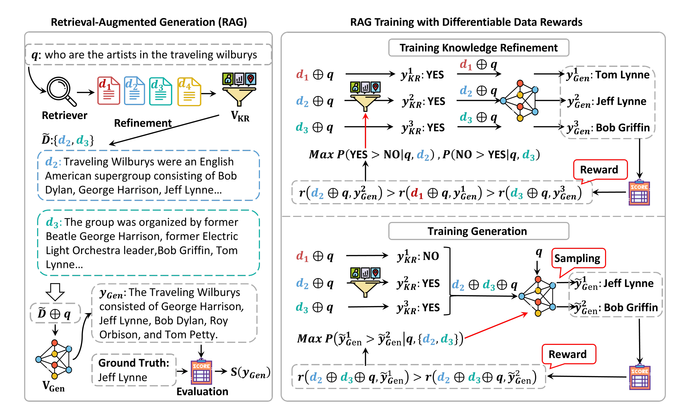

##### **方法概述**

现有 RAG 系统面临两大挑战：其一，检索文档可能包含大量噪声信息；其二，检索到的外部知识可能与模型参数中的内在知识存在冲突。这些问题显著影响了大语言模型（LLM）在生成过程中的准确性与可靠性。为了增强 LLM 的检索增强能力，常见的方法是基于知识密集型任务进行监督微调。然而，由于训练过程中对标签数据的高度依赖，导致泛化能力不足，难以适应复杂多样的实际应用场景。

为解决上述问题，我们提出了端到端 RAG 系统优化方案—— **BugAgaric-DDR** 。该方法利用 **rollout 技术** 对 RAG 模块的奖励分数进行系统化评估，并针对性地优化模型，使其更好地对齐数据偏好。通过面向具体任务场景的  **定向数据采样** ，生成符合 **Direct Preference Optimization（DPO）** 方法要求的偏好数据对，并基于 DPO 进行高效训练，显著提升系统在特定任务中的性能表现。

在 **BugAgaric-DDR** 中，我们基于知识库中预处理后的文档信息，采用高性能模型构建包含 **Query、Ground-truth 和 Keypoints** 的三元组数据，并通过检索模型生成  **Reference** ，从而构建标准化的原始数据集。此外，采用  **DDR 数据采样策略** ，使模型在内在知识和外部知识两种场景下，通过调整温度参数和重复采样机制，为每条查询生成多样化的回复。结合标注的监督标签，自然获取每个回复的奖励分数，并选取最高分回复作为正例，最低分回复作为负例，从而构造高质量的偏好训练数据对。

该数据构造策略不仅显著提升了模型在不同知识场景下的适应性与生成质量，还实现了高度集成化的一键式数据构造功能。用户仅需上传文档并选择目标模型，即可自动完成训练数据的全流程生成，同时支持 **DPO** 和 **SFT** 等多种训练方式。该方案显著降低了操作门槛与数据构造成本，为 RAG 场景的研究与实践提供了更高效、更便捷的解决方案。

##### **参数：**

| 参数名                   | 是否必须 | 参数类型 | 参数说明                                         | 参数示例/默认值                                   |
| ------------------------ | -------- | -------- | ------------------------------------------------ | ------------------------------------------------- |
| pipeline_type            | 是       | str      | 指定方法                                         | ddr                                               |
| Train Model Name or Path | 是       | str      | 拟进行训练的模型路径                             | your_training_model_path                          |
| Data Model Name or Path  | 是       | str      | 拟构造数据的模型路径（较训练模型性能更强的模型） | your_data_constructing_model_path                 |
| Embedding Model Path     | 是       | str      | Embedding模型路径                                | your_embedding_model_path                         |
| Config Path              | 是       | str      | yaml配置文件路径                                 | ~/config/pipeline/ddr/datasets.yaml               |
| Train Output Path        | 是       | str      | 训练集输出路径                                   | ~/resource/dataset/train_dataset/dpos_train.jsonl |
| Dev Output Path          | 是       | str      | 验证集输出路径                                   | ~/resource/dataset/train_dataset/dpos_dev.jsonl   |
| current_kb_config_id     | 是       | str      | 知识库配置id号（知识库配置完成后自动传入）       | your_current_kb_config_id                         |
| knowledge_id             | 是       | str      | 知识库id号（知识库配置完成后自动传入）           | your_knowledge_id                                 |
| knowledge_stat_tab_path  | 是       | str      | 知识库管理表格路径（知识库配置完成后自动传入）   | your_knowledge_stat_tab_path                      |

为简化用户操作体验，我们仅列出必要参数。部分优化参数已在 YAML 配置文件中预设，用户可直接使用默认值，如有特殊需求可自行调整：

| 参数名              | 是否必须 | 参数类型 | 参数说明                                                     | 参数示例/默认值                                   |
| ------------------- | -------- | -------- | ------------------------------------------------------------ | ------------------------------------------------- |
| VllmServer_params   | 是       | -        | VLLM 服务配置                                                | -                                                 |
| sampling_params     | 是       | -        | 生成控制参数（构造数据模型）                                 | -                                                 |
| max_data_nums       | 是       | int      | 构造数据的最大数量                                           | 5000                                              |
| top_k               | 是       | int      | 检索时返回的文档数量                                         | 5                                                 |
| method              | 是       | str      | 检索方式，例如 "dense" 表示使用稠密检索                      | dense                                             |
| Augment_template    | 是       | str      | 数据增强模板                                                 | Background{}Question:{}Answer:                    |
| QA_template         | 是       | str      | 问答模板                                                     | Question:{}Answer:                                |
| max_prompt_length   | 是       | int      | prompt最大长度                                               | 4096                                              |
| max_passage_length  | 是       | int      | 检索文档的最大长度（应小于max_prompt_length）                | 2000                                              |
| passage_separator   | 是       | str      | 不同文档之间间隔符                                           | \n                                                |
| model_type          | 是       | str      | 指定模型的类型                                               | minicpm3（可选择minicpm3、minicpm2、llama_style） |
| use_template        | 是       | bool     | 指定是否在模型输入阶段使用模板                               | True                                              |
| batch_size          | 是       | int      | 数据处理时的批次大小                                         | 64                                                |
| dpo_sampling_params | 是       | -        | DPO采用生成控制参数（待训练模型）                            | -                                                 |
| metric              | 是       | str      | 采样评估指标                                                 | rouge（可选择rouge、em、accuracy、f1）            |
| ratio               | 是       | float    | 训练和测试数据的划分比例，例如"0.1"表示将 10% 数据用于测试。 | 0.1                                               |

##### **图示**

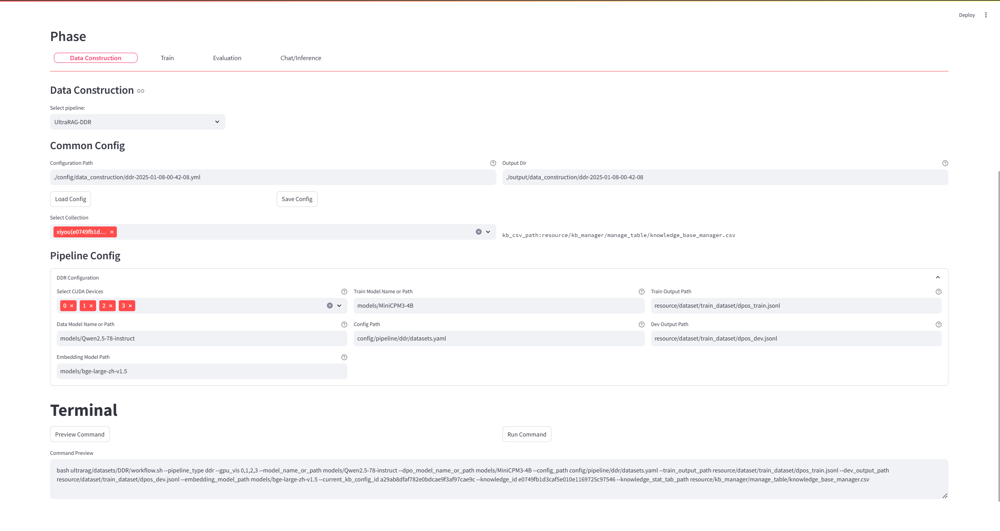

##### **输出数据格式**

```JSON
{"file_index": 1, "chunk_index": 1, "chunk": "xxx","query": "xxx", "ground_truth": "xxx", "keypoints": "1. xxx\n2. xxx" , "retrieval_result": ["xxx", "xxx", "xxx", "xxx", "xxx"], "id": 1, "raw_input": "xxx", "augment_input": "xxx",
"context": [
{"text": "xxx", "temperature": 0.5, "type": "raw", "x_score": 0.85}, 
{"text": "xxx", "temperature": 0.5, "type": "aug", "x_score": 0.62}, 
{"text": "xxx", "temperature": 0.6, "type": "raw", "x_score": 0.59},
{"text": "xxx", "temperature": 0.6, "type": "aug", "x_score": 0.43}, 
{"text": "xxx", "temperature": 0.7, "type": "raw", "x_score": 0.58}, 
{"text": "xxx", "temperature": 0.7, "type": "aug", "x_score": 0.69}, 
{"text": "xxx", "temperature": 0.8, "type": "raw", "x_score": 0.25}, 
{"text": "xxx", "temperature": 0.8, "type": "aug", "x_score": 0.74}, 
{"text": "xxx", "temperature": 0.9, "type": "raw", "x_score": 0.55}, 
{"text": "xxx", "temperature": 0.9, "type": "aug", "x_score": 0.91}
], 
"chosen": {"text": "xxx", "temperature": 0.9, "type": "aug", "x_score": 0.91}, 
"rejected": {"text": "xxx", "temperature": 0.8, "type": "raw", "x_score": 0.25}}
```

#### BugAgaric-Vis

论文地址: https://arxiv.org/abs/2410.10594

模型地址: https://huggingface.co/openbmb/VisRAG-Ret

仓库地址: https://github.com/OpenBMB/VisRAG

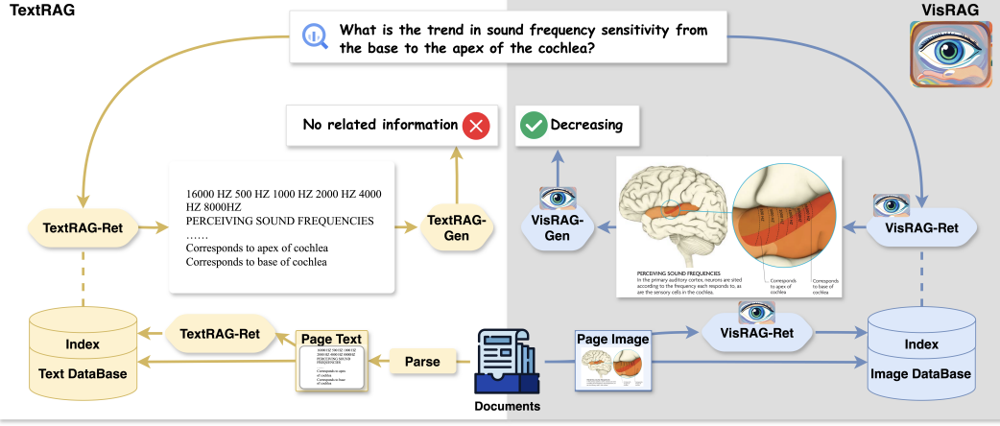

##### 方法概述

**BugAgaric-Vis**是一个基于视觉语言模型（VLM）的新型检索增强生成（RAG）管道。与传统的文本解析方法不同，BugAgaric-Vis直接将文档作为图像嵌入，通过VLM进行检索和生成。这种方法最大化了原始文档中数据的保留与利用，避免了传统文本解析过程中可能造成的信息丢失。

**BugAgaric-Vis**的工作流程主要分为两个模块：**检索模块（VisRAG-Ret）** 和  **生成模块（VisRAG-Gen）** 。与传统的文本解析方法不同，BugAgaric-Vis直接利用图像嵌入进行信息检索，避免了传统文档解析（如OCR或文本抽取）过程中可能引入的损失。

###### 1. **VisRAG-Ret：文档检索模块**

VisRAG-Ret模块的核心任务是将输入的查询和文档（图像）转换为嵌入向量。该模块使用MiniCPM-V 2.0模型，集成了SigLIP作为视觉编码器和MiniCPM-2B作为LLM Backbone，从而能同时处理视觉和文本信息。在处理查询和文档时，VisRAG-Ret首先将它们嵌入到共享的向量空间中，并通过相似度计算（例如点积或余弦相似度）来匹配最相关的文档。

* **输入** ：文本查询或图像文档。
* **处理** ：对输入进行视觉编码和语言编码，生成对应的嵌入向量。
* **输出** ：查询和文档的嵌入向量，用于后续的检索和生成任务。

###### 2. **VisRAG-Gen：生成模块**

VisRAG-Gen模块利用由VisRAG-Ret模块检索而来的文档，结合查询生成相应的文本内容。与传统的RAG方法不同，VisRAG-Gen直接使用现成的视觉语言模型（如MiniCPM-V 2.0、MiniCPM-V 2.6和GPT-4o）进行生成任务。

* **输入** ：查询和从检索模块获得的文档。
* **处理** ：将查询和文档作为输入传递给生成模型，通过生成模型生成文本。
* **输出** ：根据输入查询和相关文档生成的文本。

###### 3. **核心特点与优势**

* **无需文档解析** ：**BugAgaric-Vis**直接将文档作为图像输入，避免了传统解析过程中的信息丢失。
* **多模态处理** ：同时处理视觉和语言信息，适应不同类型的文档（如学术文章、图像或图文混排文档）。
* **灵活的生成能力** ：直接使用现有的视觉语言模型进行生成，具有较高的灵活性。
* **提升信息利用率** ：相比于传统的文本解析RAG，**BugAgaric-Vis**通过保留文档的原始视觉信息，最大限度地提高了信息的利用率。

#### BugAgaric-Embedding

模型地址：https://huggingface.co/openbmb/MiniCPM-Embedding-Light
MiniCPM-Embedding-Light是由面壁智能与清华大学自然语言处理实验室（THUNLP）、东北大学信息检索小组（NEUIR）共同开发的中英双语言文本嵌入模型，具有出色的中文、英文检索能力；出色的中英跨语言检索能力，超越了流行的bge-m3等模型。支持长文本（最长8192token），提供稠密向量与token级别的稀疏向量，并且允许可变的稠密向量维度（套娃表征）。

MiniCPM-Embedding-Light结构上采取双向注意力和 Weighted Mean Pooling。采取多阶段训练方式，共使用包括开源数据、机造数据、闭源数据在内的约260M条训练数据。得益于精心设计的领域自适应数据合成方法（已集成到UltraRAG），MiniCPM-Embedding-Light在检索任务上性能表现优异。

| 模型 Model                                                   | C-MTEB/Retrieval(NDCG@10) | BEIR(NDCG@10) |
| ------------------------------------------------------------ | ------------------------- | ------------- |
| bge-large-zh-v1.5                                            | 70.46                     | -             |
| gte-large-zh                                                 | 72.49                     | -             |
| Conan-embedding-v1                                           | 76.67                     | ``            |
| bge-large-en-v1.5                                            | -                         | 54.29         |
| modernbert-embed-large                                       | -                         | 54.36         |
| snowflake-arctic-embed-l                                     | -                         | 55.98         |
| gte-en-large-v1.5                                            | -                         | 57.91         |
| me5-large                                                    | 63.66                     | 51.43         |
| bge-m3(Dense)                                                | 65.43                     | 48.82         |
| gte-multilingual-base(Dense)                                 | 71.95                     | 51.08         |
| jina-embeddings-v3                                           | 68.60                     | 53.88         |
| gte-Qwen2-1.5B-instruct                                      | 71.86                     | 58.29         |
| MiniCPM-Embedding                                            | 76.76                     | 58.56         |
| MiniCPM-Embedding-Light(Dense)                               | 72.71                     | 55.27         |
| MiniCPM-Embedding-Light(Dense+Sparse)                        | 73.13                     | 56.31         |
| MiniCPM-Embedding-light(Dense+Sparse)+MiniCPM-Reranker-Light | 76.34                     | 61.49         |

| 模型  Model                                           | MKQA En-Zh_CN (Recall@20) | NeuCLIR22 (NDCG@10) | NeuCLIR23 (NDCG@10) |
| ----------------------------------------------------- | ------------------------- | ------------------- | ------------------- |
| me5-large                                             | 44.3                      | 9.01                | 25.33               |
| bge-m3(Dense)                                         | 66.4                      | 30.49               | 41.09               |
| gte-multilingual-base(Dense)                          | 68.2                      | 39.46               | 45.86               |
| MiniCPM-Embedding                                     | 72.95                     | 52.65               | 49.95               |
| MiniCPM-Embedding-Light(Dense)                        | 68.29                     | 41.17               | 45.83               |
| MiniCPM-Embedding-Light(Dense)+MiniCPM-Reranker-Light | 71.86                     | 54.32               | 56.50               |

##### 方法概述：

在日常RAG场景中，用户提供的文档库往往是高度领域化的，而没有在对应领域上微调过的检索模型，往往性能表现欠佳。而使用对应领域数据微调检索模型，一般可以大幅度提升检索效果；然而，用于模型微调的query-doc对的收集是一个问题；为此，我们通过LLM，对用户提供的文档，自动生成对应的query，并进行负例挖掘、数据清洗，用于检索模型、重排模型微调，以便提升RAG链路上的检索效果效果。

我们这一模块包括：数据预处理、query合成、负例挖掘、数据清洗四部分。

##### 数据预处理：

在这一模块，我们将用户文档进行处理，对每个文档，挖掘一定数量与其语义相似的文档，用于后续的数据合成。做法是用Embedding计算出文档的向量，并计算其与文档库中其它文档的cos相似度，取相似度排名靠前的文档。

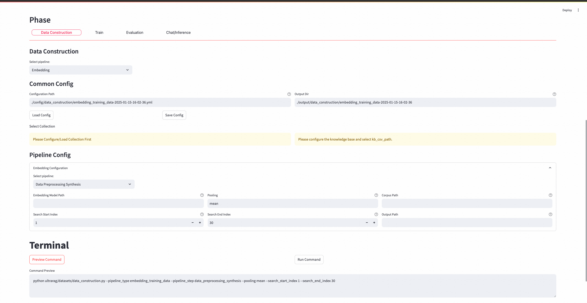
文档数据格式 `corpus.jsonl`：

```JSON
 {"contents": "这是文档1"}
```

传入参数:

| 参数名             | 是否必须 | 参数类型 | 参数说明                                      | 参数示例/默认值              |
| ------------------ | -------- | -------- | --------------------------------------------- | ---------------------------- |
| embed              | 是       | str      | 用于做数据预处理的embedding 模型的路径        | ~/BugAgaric-Vec               |
| pooling            | 否       | str      | 用于做数据预处理的embedding 模型的pooling方法 | mean                         |
| corpus_path        | 是       | str      | 用户文档切片路径                              | ~/dataset/corpus.jsonl       |
| output_path        | 是       | str      | 输出路径                                      | ~/dataset/preprocessed.jsonl |
| search_start_index | 否       | int      | 挖掘文档范围的起点``                          | 1                            |
| search_end_index   | 否       | int      | 挖掘文档范围的终点                            | 30                           |

输出：预处理后的数据格式 `synthesis_qd.jsonl`

```JSON
{"doc": "doc", "sims":  ["doc", "doc2"]}
```

##### 数据合成：

这一模块，我们对用户文档合成对应的query，支持中文与英文。可以根据用户提供的query示例进行few shot合成；也可直接进行zero shot合成。我们会将目标文档，以及随机抽取一个，前一阶段得到的与其语义相似的负例文档同时提供给生成模型，让它生成与目标文档相关，而与负例文档无关的query。

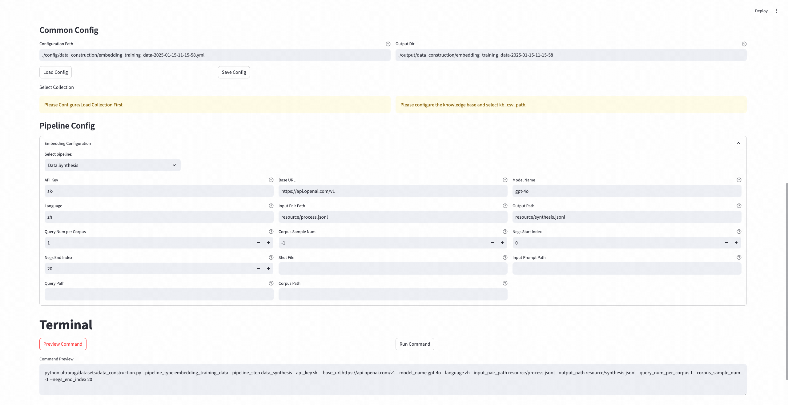

输入文件 `input.jsonl`格式：

```JSON
{"doc": "doc", "sims":  ["doc", "doc2"]}
```

例子数据 `shot.jsonl`、输出格式 `output.jsonl`：

```JSON
{"query": "这是query1", "pos": ["这是正确文档1"]}
```

输出也支持多文件格式（与评测、beir对齐）：

包括查询数据 `query.jsonl` 文档数据 `corpus.jsonl`三元组文件 `qrels.tsv`共三个文件

查询数据格式 `query.jsonl` 文档数据格式 `corpus.jsonl`：

```JSON
 {"_id": "aaa", "text": "这是文档1"}
 {"_id": "aaa", "text": "这是查询1"}
```

三元组文件格式 `qrels.tsv`（注意分隔符为\t）

```Plain
query-id    corpus-id    score
aaa    bbb    1
```

传入参数：

| 参数名                            | 是否必须       | 参数类型 | 参数说明                                                 | 参数示例/默认值                  |
| --------------------------------- | -------------- | -------- | -------------------------------------------------------- | -------------------------------- |
| api_key                           | 是             | str      | Openai like 生成模型的API                                | sk-114514NYNICG                  |
| base_url                          | 是             | str      | Openai like 生成模型的服务器url                          | ~/dataset/corpus.jsonl           |
| model_name                        | 是             | str      | Openai like 生成模型的名称                               | gpt-4o                           |
| language                          | 是             | str      | 用户文档语言，目前支持中文与英文，分别为zh,en            | zh                               |
| input_pair_path                   | 是             | str      | 预处理好的文档文件地址``                                 | ~/dataset/preprocessed.jsonl     |
| output_path                       | 是             | str      | 输出文件地址                                             | ~/dataset/synthesis_train.jsonl  |
| ~/dataset/qrels.tsv（三文件格式） |                |          |                                                          |                                  |
| query_num_per_corpus              | 是             | int      | 对每个文档合成多少个query                                | 5                                |
| query_path                        | 否             | str      | 输出查询文件地址（如果填了这项，则按三文件输出模式输出） | ~/dataset/synthesis_query.jsonl  |
| corpus_path                       | 否             | str      | 输出文档文件地址（如果填了这项，则按三文件输出模式输出） | ~/dataset/synthesis_corpus.jsonl |
| corpus_sample_num                 | 否             | int      | 对多少条文档造查询                                       | -1（默认全部）                   |
| neg_start_index                   | 否             | int      | 抽取负例文档范围的起点``                                 | 1                                |
| negs_end_index                    | 否             | int      | 抽取负例文档范围的终点                                   | 30                               |
| shot_num                          | 否             | int      | Few shot合成时提供的shot数量                             |                                  |
| 设为0则使用zero shot              | 0（Zero shot） |          |                                                          |                                  |
| shot_file                         | 否             | str      | 用户提供的例子文件                                       | ~/dataset/shot.jsonl             |
| input_prompt_path                 | 否             | str      | 用户提供的自定义造数据Prompt                             | ~/prompt.txt                     |

##### 负例挖掘：

对于embedding模型与reranker模型，在训练时都需要提供正例与负例，我们在上一步对文档合成了query，那么对于query，这个文档就是正例；之后，我们要从文档库中，根据query与文档的相似度，挖掘语义相近的文档，作为query的负例；（当然，我们挖掘的负例，很有可能也与query相关，即假阴性；在下一步，我们会进行数据清洗，尽力过滤假阴性）

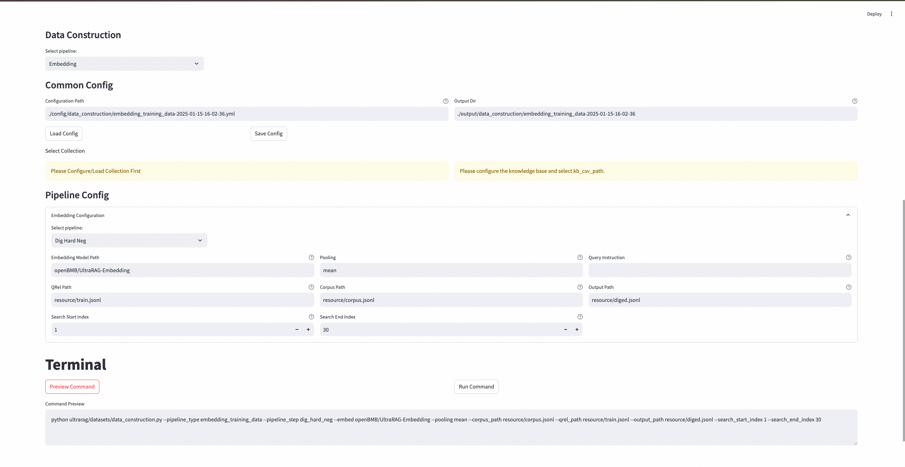

训练数据格式 `train.jsonl`

```JSON
{"query": "这是query1", "pos": ["这是正确文档1"]}
```

文档数据格式 `corpus.jsonl`：

```JSON
 {"id": "aaa", "contents": "这是文档1"}
```

传入参数:

| 参数名             | 是否必须 | 参数类型 | 参数说明                                                     | 参数示例/默认值         |
| ------------------ | -------- | -------- | ------------------------------------------------------------ | ----------------------- |
| embed              | 是       | str      | 用于做数据预处理的embedding 模型的路径                       | ~/BugAgaric-Vec          |
| pooling            | 否       | str      | 用于做数据预处理的embedding 模型的pooling方法                | mean                    |
| query_instruction  | 否       | str      | 用于做数据预处理的embedding 模型的query前面要加的Instruction | None（不加Instruction） |
| corpus_path        | 是       | str      | 用户文档切片路径                                             | ~/dataset/corpus.jsonl  |
| qrel_path          | 是       | str      | 训练数据路径                                                 | ~/dataset/train.jsonl   |
| output_path        | 是       | str      | 输出路径                                                     | ~/dataset/diged.jsonl   |
| search_start_index | 否       | int      | 挖掘文档范围的起点``                                         | 1                       |
| search_end_index   | 否       | int      | 挖掘文档范围的终点                                           | 30                      |

##### 数据清洗：

在这一阶段，我们希望过滤数据中的假阴性、假阳性样本，提升训练数据质量。一些常用的方法包括按照query与正例和负例相似度分数的比值或差，过滤假阴性；按照query与正例的排名过滤假阳性（此处的做法是通过过滤阴性，在一条数据包含负例较少时舍弃，即做到了过滤正例排名低的样本）

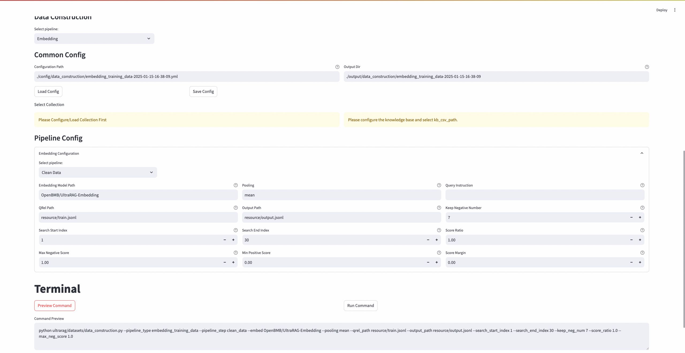

数据格式 `train.jsonl`

```JSON
{"query": "这是query1", "pos": ["这是正确文档1"]}
```

传入参数:

| 参数名              | 是否必须 | 参数类型 | 参数说明                                                     | 参数示例/默认值         |
| ------------------- | -------- | -------- | ------------------------------------------------------------ | ----------------------- |
| embed/reranker      | 是       | str      | 用于做数据预处理的embedding/reranker 模型的路径              | ~/BugAgaric-Vec          |
| ~/BugAgaric-Reranker |          |          |                                                              |                         |
| pooling             | 否       | str      | 用于做数据预处理的embedding 模型的pooling方法                | mean                    |
| query_instruction   | 否       | str      | 用于做数据预处理的embedding 模型的query前面要加的Instruction | None（不加Instruction） |
| qrel_path           | 是       | str      | 训练数据路径                                                 | ~/dataset/diged.jsonl   |
| output_path         | 是       | str      | 输出路径                                                     | ~/dataset/clean.jsonl   |
| search_start_index  | 否       | int      | 文档负例范围的起点``                                         | 1                       |
| search_end_index    | 否       | int      | 文档负例范围的终点                                           | 30                      |
| keep_neg_num        | 否       | int      | 每一条保留负例数量                                           | 7                       |
| score_ratio         | 否       | float    | 负例分数/正例分数的最大比值                                  | 1.0                     |
| score_margin        | 否       | float    | 正例分数-负例分数的最小值                                    | 0.0                     |
| min_pos_score       | 否       | float    | 最小正例分数                                                 | 0.0                     |
| max_neg_score       | 否       | float    | 最大负例分数``                                               | 0.0                     |
