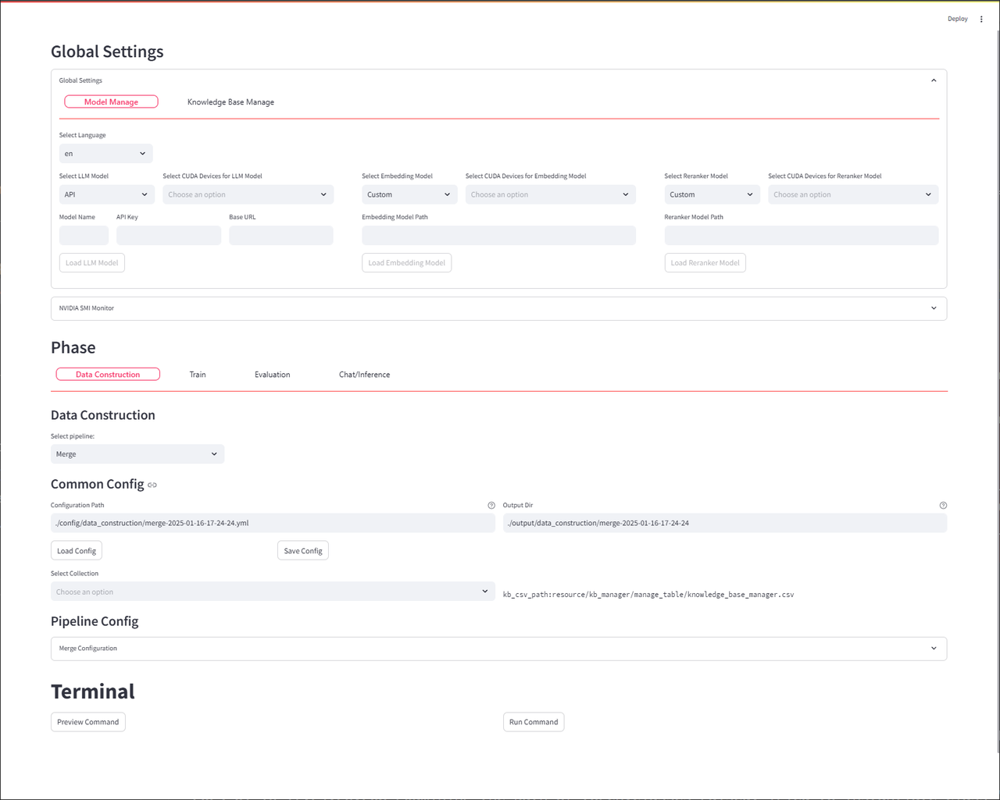
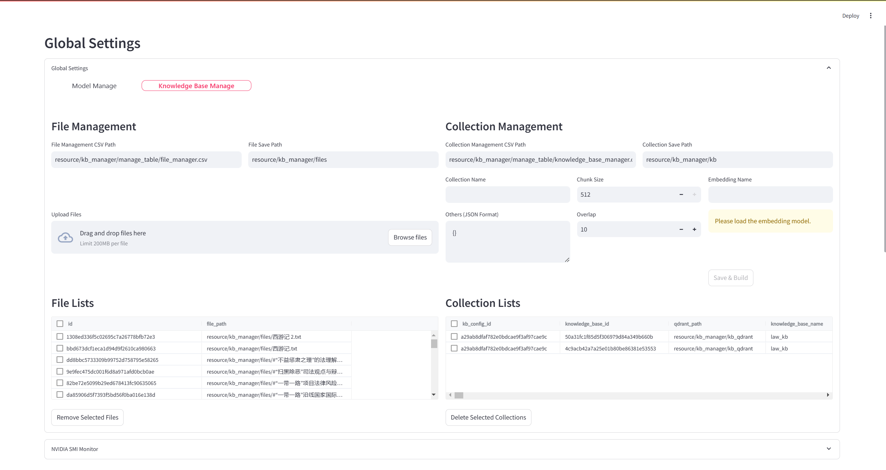
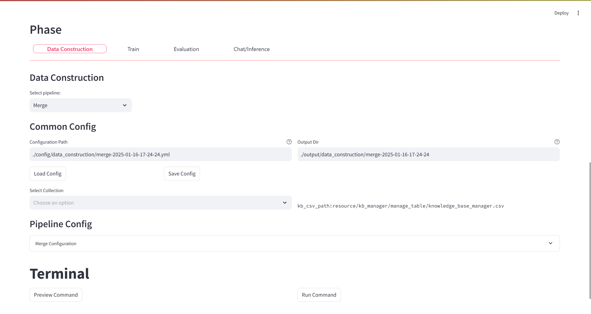
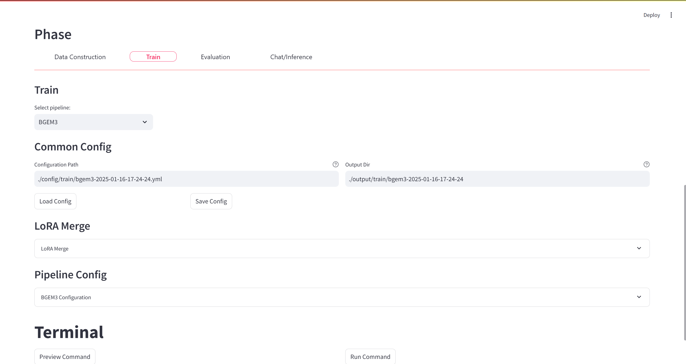
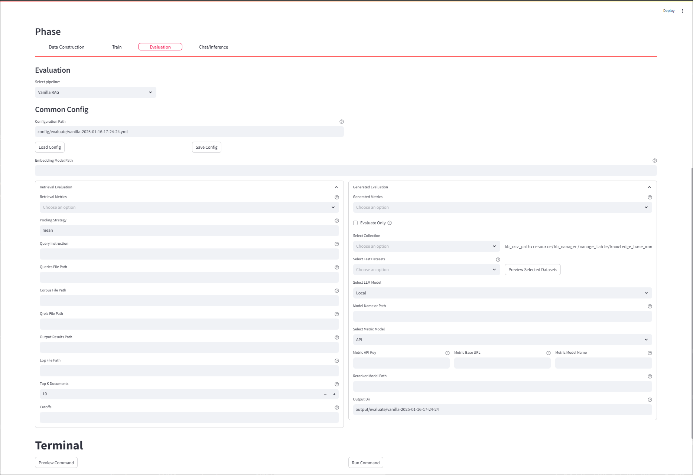

### Introduction and Usage Guide for WebUI

WebUI uses a **two-section layout**. The top of the page is for **Global Settings**, while the bottom is for **Configuring Each Stage of the Process**. Global Settings includes the **Model Management** and **Knowledge Management** tabs. Process configuration covers the stages of **Data Construction, Training, Evaluation**, and **Inference**.

When using WebUI, the following steps are typically followed:

1. Select and load the appropriate model on the **Model Management** page;
2. Switch to the **Knowledge Management** page to upload documents and complete the knowledge base construction;
3. Go to the **Chat/Inference** page to choose the suitable workflow for interaction.

Below, we will introduce the specific usage methods for each section of WebUI.

#### Model Management

Model Management includes three types of models: **LLM, Embedding**, and **Reranker**. Currently, it supports both **local loading** and **API loading**. In the future, more models will be supported, and a **one-click microservice launch** feature will be provided to optimize the model management process.

Users can download the required models from model repositories like **ModelScope** and **Hugging Face**, deploying them flexibly to meet the demands of different application scenarios.

##### Inference Supported Models

| Model Type | Local Model             | Microservice                            |
|------------|-------------------------|-----------------------------------------|
| LLM        | Models supported by VLLM| MiniCPM-V and other models supported by VLLM |
| Embedding  | bge, minicpm-embedding  |                                         |
| Reranker   | bge-large-reranker      |                                         |

#### Knowledge Base Management

Knowledge Base Management is composed of **File Management** and **Knowledge Base Management**. Currently supported file types include **PDF** and **TXT**. The usage process is as follows:

1. **Upload File**: Users must first upload the files and load the corresponding Embedding model;
2. **File Selection**: After selecting the required files, configure the basic parameters of the knowledge base;
3. **Knowledge Base Construction**: After completing the parameter configuration, you can build the knowledge base. The **Model Name** is the only identifier for determining whether the knowledge base can be mixed-use and must be customized by the user.

Note: Both File Management and Knowledge Base Management are maintained by their respective **CSV tables**, recording the relevant basic information.

The constructed knowledge base will include the following three parts for downstream algorithm use:

- **Index** (used for retrieving top_k results);
- **Org_Files** (original files);
- **Chunk_Files** (chunked files).

##### Illustration:

#### Data Construction

On the **Data Construction** page, we provide data construction methods for various algorithms, currently mainly supporting downstream tasks such as **Training** and **Evaluation**. In the future, functionality will be further expanded, such as supporting the automatic construction of knowledge base data.

##### Illustration:

### Training

The training page mainly supports the training of **LLM** and **Embedding** models, with only partial core parameter configurations available on the interface. **LoRA** is primarily used for LLM training, allowing users to flexibly input specific parameters through configuring **YAML** files.

**Main features include:**

- **Dataset preview** (resource/dataset/train_dataset);
- **SFT/DPO training** to meet various fine-tuning needs;
- **Embedding model training** for efficient vector representation;
- **Support for other training algorithms** (e.g., BugAgaric-KBAlign);
- **LoRA parameter merging** to enhance the flexibility of model training.

##### Illustration:

### Evaluation

The evaluation page allows for one-click evaluation of multiple processed datasets, covering both **retrieval** and **generation** modules. Additionally, users can directly calculate various metric scores for already generated result files, provided that the file formats comply with the specifications.

**Main features include:**

- **Dataset preview** (resource/dataset/test_dataset) to check data integrity;
- **Retrieval metrics evaluation** to measure model retrieval precision and recall performance;
- **Generation metrics evaluation** to assess the quality and consistency of generated text;
- **Integrated retrieval+inference+evaluation**, supporting **API** and **vLLM** based workflows;
- **Direct evaluation** for already generated and compliant result files to quickly obtain evaluation results.

##### Illustration:

### Chat/Inference

The chat page supports multiple workflows, including **Vanilla RAG**, **BugAgaric-VisRAG**, **BugAgaric-KBAlign**, and **BugAgaric-Adaptive-Note**, with plans to continuously expand more workflows to further enhance the system's flexibility and applicability. Before using the chat function, users need to complete the following steps:

1. Select an appropriate model and build a knowledge base;
2. After completing the above steps, select the corresponding workflow and knowledge base to initiate the chat process.

##### Basic Usage

**Engaging in dialogue using WebUI and VanillaRAG requires the following steps:**

1. **Model Configuration:** In the **Model Configuration Panel**, select the default model path and sequentially load the **large model, embedding model,** and **rerank model**.
2. **Knowledge Configuration:**
   1. In the **Knowledge Configuration Panel,** upload a file (e.g., PDF);
   2. Select the uploaded file and use the default parameters to build the knowledge base.
3. **Chat Experience:** In the **Experience Panel,** select **Chat/Inference**, check the knowledge base and workflow to start interacting in the chat window.

For detailed operational instructions, please refer to the demonstration video.

##### VisRAG

**Engaging in dialogue using WebUI and VisRAG requires the following steps:**

1. **Load LLM Model:** In the **Model Configuration Panel,** enter the **MiniCPM-V** model path, select the **GPU**, and then click **Load** to complete the LLM loading.
2. **Load Embedding Model:** In the **Model Configuration Panel,** enter the **VisRAG-Ret** model path, select the **GPU**, and then click **Load** to complete the embedding model loading.
3. **Knowledge Base Construction:**
   1. In the **Knowledge Configuration Panel,** upload a file (e.g., PDF) or check a previously uploaded file;
   2. Select the uploaded file and use the default parameters to build the knowledge base.
4. **Chat Experience:** In the **Experience Panel,** select **Chat/Inference**, check the knowledge base and workflow to start the interaction in the window.

For detailed operational instructions, please refer to the demonstration video.

##### VisRAG/Adaptive-Note Evaluation

Refer to the demonstration video for evaluation operations, which need to follow these steps:

1. **Select Workflow:** Select the workflow to be tested.
2. **Select Knowledge Base:** Choose the knowledge base needed for testing.
3. **Configure Evaluation Parameters:** Check the evaluation set and metrics; specify the output path for results.
4. **Run Command:** Click **Preview Command** to get the corresponding run command; click **Execute Command** to perform the evaluation on the frontend and preview execution results in real-time in the window below.

**Suggestion:** Since evaluation time may be long, closing the frontend might interrupt the command execution. It is recommended to copy the command obtained and run it locally on the server to ensure stability and completeness of the evaluation process.

