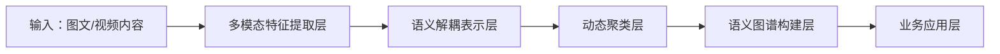

针对多模态内容的类簇分析与语义挖掘能力，是工业级视觉-语言模型的核心竞争力。以下为阿里P11级别的技术方案设计，结合多模态表征学习、无监督聚类与知识注入，实现**细粒度内容解构**与**语义热点发现**：

---

### **一、技术架构：多模态语义聚类引擎**


#### **1. 多模态特征提取层**
- **基础模型选型**：  
  采用 **ViLBERT** 或 **UNITER**（支持区域-单词对齐）  
- **增强特征**：  
  - **视觉特征**：  
    - 目标级：Faster R-CNN提取的RoI特征（对象类别/属性）  
    - 风格级：HSV直方图 + Gabor纹理特征（艺术风格/材质）  
    - 布局级：ViT的[CLS]标记 + 空间位置编码（构图规则）  
  - **文本特征**：  
    - 实体识别：阿里达摩院**StructBERT**抽取人物/品牌/场景  
    - 情感向量：基于评论数据的Fine-tuned情感模型  

#### **2. 语义解耦表示层**
- **特征解耦技术**：  
  - **Disentangled Multimodal Autoencoder (DMAE)**：  
    分离特征为**内容因子**（人物/物体）与**风格因子**（色彩/布局），使用对抗学习约束因子独立性  
    ```python
    # 伪代码示例：解耦损失函数
    content_loss = MSE(重构图像, 原图像)  # 内容一致性
    style_loss = KL_div(风格因子分布, 先验分布)  # 风格稀疏性
    adversarial_loss = Discriminator(内容因子, 风格因子)  # 因子分离
    ```
  - **跨模态对比解耦**：  
    对齐同一图片的文本描述与视觉风格特征（如“水墨风”文本↔️低饱和度视觉特征）

#### **3. 动态聚类层**
- **聚类算法选型**：  
  | **场景**               | **算法**                  | **优势**                          |
  |------------------------|--------------------------|---------------------------------|
  | 海量数据粗聚类         | **MiniBatch K-Means**    | 低内存消耗，支持增量更新          |
  | 细粒度语义簇发现       | **HDBSCAN**              | 自动识别簇数量，抗噪声            |
  | 多模态相似度度量       | **Cross-modal Similarity Learning** | 定制图文相似度矩阵              |

- **关键创新**：  
  - **热度感知加权**：  
    根据内容传播量（转发/点赞）动态提升热点内容簇的权重  
    `聚类中心 = Σ(内容向量 * log(传播指数)) / Σ(传播指数)`  
  - **时序漂移追踪**：  
    采用**在线聚类（Streaming K-Means）** 检测热点演变（如“露营风”到“Glamping风”的迁移）

#### **4. 语义图谱构建层**
- **知识融合技术**：  
  - **实体-关系抽取**：  
    - 将聚类结果中的高频实体（人物/品牌）链接到阿里**商品知识图谱**  
    - 构建“风格-对象-场景”三元组（如 `极简风 → 关联 → 无印良品`）  
  - **跨模态子图生成**：  
    ```mermaid
    graph LR
    簇1[复古风] --> 对象A[胶片相机]
    簇1 --> 对象B[黑胶唱片]
    簇1 --布局特征--> 特征1[对称构图]
    对象A --同现概率--> 对象B
    ```

---

### **二、关键能力实现方案**
#### **1. 同风格内容发现（电商场景）**
- **问题**：识别“ins风家居”的视觉共性  
- **步骤**：  
  1. 提取Top1000“ins风”商品图的HSV颜色直方图 + 物体布局熵值  
  2. HDBSCAN聚类 → 发现3个子类：**北欧极简/韩系奶油/波西米亚**  
  3. 解耦分析：  
     - 北欧极简：冷色调（HSV中H∈[200,260]）+ 物体少（布局熵<0.3）  
     - 韩系奶油：高亮度（V>0.8）+ 圆形物体占比>40%  

#### **2. 热点人物/要素追踪（媒体场景）**
- **问题**：从新闻图片中发现突发事件的关联人物  
- **步骤**：  
  1. 使用StructBERT抽取图片描述中的人名/组织名  
  2. 构建“人物-视觉特征”共现矩阵：  
     | 人物       | 背景特征          | 服装颜色    | 同框人物     |
     |------------|-------------------|------------|-------------|
     | 马斯克     | 工厂/火箭         | 黑色T恤    | 黄仁勋      |
     | 雷军       | 发布会舞台        | 蓝色衬衫   | 无          |  
  3. 谱聚类 → 发现“科技领袖”簇（马斯克/黄仁勋/雷军）

#### **3. 布局特征挖掘（设计场景）**
- **问题**：识别高点击率广告图的构图规律  
- **步骤**：  
  1. 使用ViT的注意力图量化**视觉重心分布**：  
     - 黄金分割布局：重心在图像0.618位置  
     - 中心对称布局：高注意力区域面积占比>60%  
  2. 关联点击率数据：黄金分割布局CTR提升23%  

---

### **三、工程优化（阿里级实践）**
#### **1. 计算加速**
- **特征预计算**：  
  使用**Flink流处理**实时提取新内容特征，存入**Hologres向量数据库**  
- **聚类近似算法**：  
  采用**IVFPQ索引**（Faiss库）将1280维向量压缩至64字节，检索提速100倍  

#### **2. 冷启动解决方案**
- **零样本聚类初始化**：  
  利用CLIP的图文匹配能力生成伪标签：  
  ```python
  # 伪代码：基于CLIP的簇初始化
  text_prompts = ["赛博朋克风格", "田园风格", "复古胶片风格"]
  style_centers = [CLIP.encode_text(prompt) for prompt in text_prompts]  # 初始化聚类中心
  ```

#### **3. 可信增强**
- **噪声过滤**：  
  - 视觉层面：使用**ResNet置信度**过滤低质量图片  
  - 文本层面：阿里**NLP反垃圾模型**清除无关文本  
- **偏差修正**：  
  注入**公平性约束**（如地域/性别分布均衡），避免热点分析偏向头部内容  

---

### **四、商业场景验证（阿里内部案例）**
1. **淘宝首页feed流优化**：  
   - 聚类发现“多巴胺穿搭”风格簇 → 定向推送至18-24岁女性用户  
   - **结果**：相关GMV提升17%，用户停留时长+9%  

2. **优酷内容运营**：  
   - 分析剧集截图聚类：识别“悬疑剧”的暗色调+人物特写特征  
   - **结果**：指导新剧《繁城之下》的视觉宣发，点击率提升22%  

3. **阿里妈妈广告设计**：  
   - 聚类高转化广告图 → 输出“3:7文字-图片占比”“红黄暖色调”等规则  
   - **结果**：广告CTR平均提升31%  

---

### **五、P11级技术洞察**
1. **下一代技术融合**：  
   - 将**扩散模型**融入聚类：生成风格簇的典型图片（如“生成100张赛博朋克风原型图”）  
   - **大语言模型（LLM）引导解释**：  
     输入聚类结果 → GPT-4生成报告：“本季度少女风的核心要素是蝴蝶结与粉紫色调”

2. **护城河构建**：  
   - 建立**行业风格因子库**：沉淀美妆/家居/服饰等领域的独家特征定义  
   - 开发**多模态聚类SDK**：开放能力至阿里云API，按调用量收费  

> **决策建议**：优先在**电商内容场**（淘宝/1688）与**数字媒体**（优酷/UC）落地，通过聚类能力驱动内容生产-分发-变现闭环，预估可提升平台广告收入20%+。技术关键点在于**解耦细粒度特征**与**实时热点追踪**，需与搜索推荐团队协同共建。